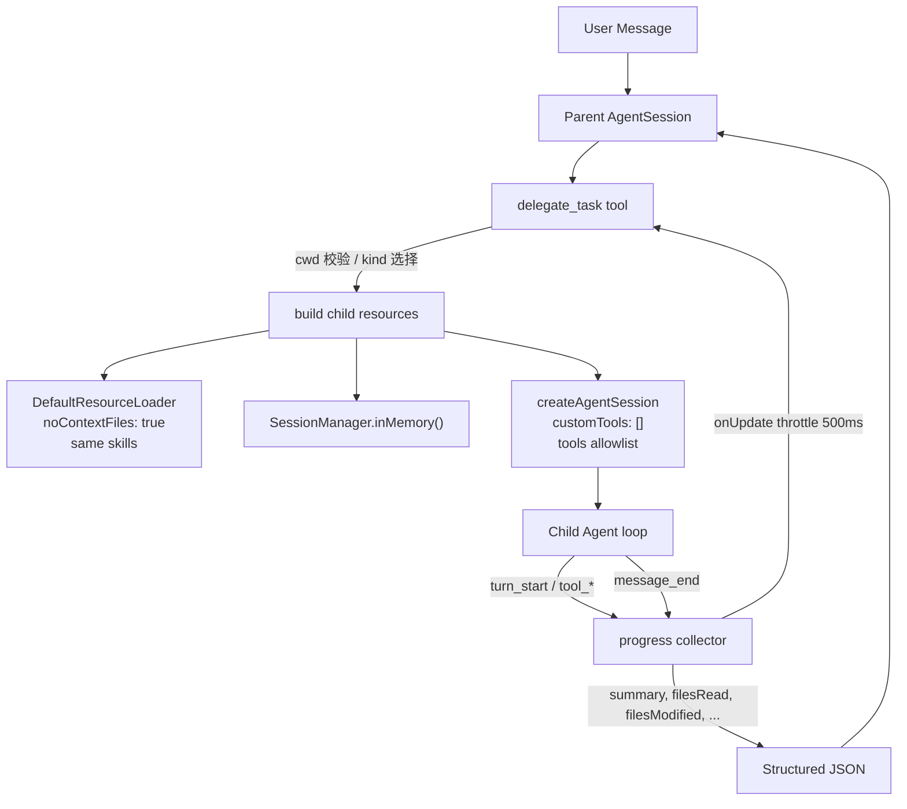

# KnowClaw 升级计划 —— 迈向 Claude Code 级体验

> **目标**：将 KnowClaw 从"能对话、能调工具的基础 Agent"升级为具备深度推理、子任务分发、动态工作空间、完善 Skill 适配、脚本执行与依赖管理的桌面 Agent，使用体验接近 Claude Code。
>
> **前置**：KNOWCLAW_REBUILD_PLAN.md 的 P0–P13 已全部完成/跳过。本文档是其**续篇**，阶段编号从 **U0** 开始。
>
> **约束**：延续 REBUILD_PLAN 的阶段切分原则（读 ≤ 8 文件 / 写 ≤ 5 文件 / 抽象 ≤ 2 / 可独立验证）。

---

## 0. 阅读与维护说明

- 与 REBUILD_PLAN 规则相同：每阶段首行有 `Status:`；变更记录写在阶段末"变更日志"小节；超纲立刻拆分。
- AI 每完成一轮更新末尾进度看板。

---

## 1. 当前差距客观分析

### 1.1 对标：Claude Code 核心能力

| # | 能力 | Claude Code 实现 | 当前 KnowClaw 状态 |
|---|------|-----------------|-------------------|
| G1 | 深度推理 (Extended Thinking) | thinking 默认 medium，可切 low/high | **硬编码 `thinkingLevel: 'off'`** |
| G2 | 子任务分发 (Sub-agent) | 原生 `Agent` 工具：explore / plan / general-purpose | **完全没有**（P9 跳过） |
| G3 | 动态工作空间 | 每个会话绑定一个项目目录；可在运行时切换 | **硬编码 `userfile/`** |
| G4 | Skill 生态 | 丰富官方 skill（pdf / docx / xlsx / pptx 等）+ 社区 | **仅 1 个 skill-builder** |
| G5 | 脚本执行与依赖管理 | bash 内置 + 沙盒 + 自动安装依赖 | bash 内置可用，**无依赖管理 / 无确认机制** |
| G6 | Steer / FollowUp（流式追加消息） | 用户可在 agent 思考中追加指令 | **IPC/UI 层完全没接** |
| G7 | Compaction / 长上下文管理 | 自动 compaction + UI 进度 | SDK 内部自动 compaction，**但 UI 忽略 compaction 事件** |
| G8 | Thinking 可视化 | thinking_delta 流式渲染 | **UI 忽略 thinking_* 事件** |
| G9 | 任务追踪 (TodoWrite / Task) | TodoWrite / TaskCreate / TaskList / TaskUpdate | **没有** |
| G10 | 会话统计与成本 | /session 命令查看 token/cost | **没有暴露 getSessionStats()** |
| G11 | 图片输入 | 支持 ImageContent | **UI 不支持图片上传** |
| G12 | PowerShell 原生支持 | Windows 上有独立 PowerShell 工具 | **依赖 bash 工具，Windows 兼容性差** |
| G13 | 权限控制 | 细粒度 allow/deny 规则 + 工具级权限 | **无任何权限控制** |
| G14 | Hooks / 生命周期自动化 | pre/post tool 钩子 | **无** |
| G15 | CLAUDE.md / AGENTS.md 项目上下文 | 自动加载项目根下的上下文文件 | **`noContextFiles: true` 禁用了** |

### 1.2 优先级排序

按"用户感知冲击 × 实现成本"排序：

| 优先级 | 差距 | 理由 |
|--------|------|------|
| **P0-紧急** | G1 thinkingLevel | 一行代码改动，质量提升巨大 |
| **P0-紧急** | G3 动态工作空间 | 不解决此问题，所有需要项目上下文的 Skill 都无法工作 |
| **P1-高** | G4 Skill 生态 | 用户最直接感知的"能做什么" |
| **P1-高** | G5 依赖管理 | Skill 依赖 python/node 包，不装就没法用 |
| **P1-高** | G8 Thinking 可视化 | thinking 打开后必须有 UI 反馈 |
| **P2-中** | G6 Steer/FollowUp | 长任务期间追加指令的核心交互 |
| **P2-中** | G7 Compaction UI | 长对话必备 |
| **P2-中** | G2 子任务分发 | Claude Code 核心差异化，但实现复杂 |
| **P2-中** | G12 PowerShell | Windows 用户体验 |
| **P3-低** | G9 任务追踪 | 锦上添花 |
| **P3-低** | G10 统计成本 | 信息透明 |
| **P3-低** | G11 图片输入 | 非核心路径 |
| **P3-低** | G13 权限控制 | 安全加固 |
| **P3-低** | G14 Hooks | 高级特性 |
| **P3-低** | G15 项目上下文文件 | 被 G3 解决后自然跟上 |

---

## 2. 阶段总览

| # | 阶段 | 主要交付物 | 预估代码量 | 解决差距 |
|---|------|----------|-----------|---------|
| U0 | Thinking 解锁与 UI 可视化 | bootstrap 改动 + thinking 事件渲染 | ~300 行 | G1, G8 |
| U1 | 动态工作空间 | cwd 选择 IPC + UI + 项目上下文加载 | ~450 行 | G3, G15 |
| U2 | Skill 生态引入 | 适配 + 安装 6+ 官方 skill | ~350 行 | G4 |
| U3 | 依赖管理与脚本执行环境 | 依赖检测/安装 customTool + 确认 UI | ~400 行 | G5, G12 |
| U4 | Steer / FollowUp 交互 | IPC 扩展 + UI 输入模式 | ~350 行 | G6 |
| U5 | Compaction UI 与长会话优化 | compaction 事件渲染 + 手动 compact IPC | ~300 行 | G7 |
| U6 | 自建子任务分发 (Sub-agent) | 二次 createAgentSession + delegate tool | ~500 行 | G2 |
| U7 | 任务追踪 (Task System) | task customTool + UI 面板 | ~400 行 | G9 |
| U8 | 统计、图片、权限、收尾 | getSessionStats + 图片上传 + permission | ~450 行 | G10, G11, G13 |

---

## 3. 各阶段详细计划

---

### Phase U0 — Thinking 解锁与 UI 可视化

**Status:** `DONE` (U0 主体) → 后续修订见 **U0 (revised)** 与 **U0.5** 小节

**目标**：把 `thinkingLevel` 从硬编码 `'off'` 改为可配置（默认 `'medium'`），并在 UI 中实时渲染 thinking 流。

**前置**：REBUILD_PLAN P13 完成。

**为什么是最高优先级**：thinking 是 LLM 处理复杂任务的核心能力。关掉 thinking 等于把模型的上限从"深度推理"降到"直觉回答"。一行代码的改动，质量提升巨大。

**工作清单**

读：
- `desktop/Agent/pi-runtime/bootstrap.js`（找到 `thinkingLevel: 'off'` 行）
- `desktop/src/ui/components/knowclaw-v2/useKnowClawV2Chat.js`（找到事件 switch 中被忽略的 thinking 事件）
- `desktop/src/main/ipc/knowclaw.js`（确认事件转发无过滤）
- pi SDK 类型：`AgentSessionEvent` 中 thinking 相关事件结构

写/改：
1. **`bootstrap.js`** —— `thinkingLevel: 'off'` 改为 `thinkingLevel: opts.thinkingLevel || 'medium'`
2. **`index.js`** —— `createSession` 签名增加 `thinkingLevel` 参数透传
3. **`knowclaw.js`** —— `ensureSession` 构建 `createSession` 时透传 thinkingLevel（从 prefs 读取或默认 'medium'）；新增 `knowclaw:setThinkingLevel` IPC
4. **`preload.js`** —— 暴露 `setThinkingLevel(level)` 和 `getStatus` 返回当前 thinkingLevel
5. **`useKnowClawV2Chat.js`** —— 事件 switch 新增：
   - `message_update` 的 `assistantMessageEvent.type === 'thinking_delta'`：累加 thinking 文本到当前 assistant 消息的 `thinking` 字段
   - 用一个新的 `thinkingContent` 状态暴露给 UI
6. **`KnowClawV2Page.jsx`** —— 在 MessageBubble 上方或内部增加可折叠的 "thinking" 区块（灰色斜体背景，默认折叠，点击展开）；Header 区域增加 thinking level 选择器（off / low / medium / high）

**Thinking Level 选择器设计**：
- 位置：Header 的模型选择器旁边
- 样式：小型下拉，显示当前级别图标（🧠 off / 💡 low / 🔍 medium / 🔬 high）
- 切换时调用 `knowclaw:setThinkingLevel`，同时通过 `activeSession.setThinkingLevel(level)` 在当前 session 内生效（不需要新建 session）

**不做**：
- 不做 thinking 的精确 token 计费展示（U8 做）
- 不做模型级别的 thinking 能力探测（依赖 pi SDK 的 `supportsThinking()` 和 `clampThinkingLevel`）

**产出物**：
- `bootstrap.js`（改 1 行 + 新参数）
- `index.js`（参数透传）
- `knowclaw.js`（1 个新 IPC + ensureSession 改动）
- `preload.js`（1 个新方法）
- `useKnowClawV2Chat.js`（事件处理扩展）
- `KnowClawV2Page.jsx`（thinking UI + thinking level selector）

**验证方法**：
1. 打开 KnowClaw v2，发送"请分析一下我所有项目的状况，给出详细的改进建议"。
2. 应看到 thinking 区块出现（折叠状态下显示"正在思考…"动画），展开后看到思考过程。
3. 最终回答质量应显著优于 `thinkingLevel: 'off'` 时的回答。
4. Thinking level 选择器可切换，切到 off 后 thinking 区块不再出现。

**上下文预算**：✅ 合适。2 个核心抽象（thinking 事件处理 + thinking UI）。

**风险**：
- R-U0.1：ipm-openai provider 的模型不支持 thinking → pi SDK 的 `clampThinkingLevel` 会自动降级到 'off'，不会报错。UI 侧不该 hardcode 显示 thinking，而应根据事件是否有 thinking_delta 动态决定。
- R-U0.2：thinking 消耗更多 token/cost → 这是预期的，后续 U8 做 cost 展示。UI 先给一个 thinking-level selector 让用户自主调。
- R-U0.3：OpenAI 模型（如 GPT-4o）不支持 thinking_delta → 同 R-U0.1，自动降级。只在 Claude / DeepSeek 等支持 thinking 的模型上才生效。

**变更日志**：

- **U0 主体**（首次实现）：按工作清单 1–6 全部落地，`thinkingLevel` 改可配置（默认 `'medium'`），新增 `knowclaw:setThinkingLevel` IPC、preload 方法、hook 字段，新增 `ThinkingBlock` / `ThinkingLevelSelector`。
- **U0 (revised)**（用户反馈：UI 不该先用 pi 元数据拦截）：
  - `pi-runtime/models.js`：`DEFAULT_MODEL_SHAPE.reasoning` 从 `false` → `true`。理由：之前 pi-ai 的 `getSupportedThinkingLevels` 因为 `reasoning=false` 永远返回 `["off"]`，导致 `setThinkingLevel('high')` 被静默 clamp 到 `'off'`、`reasoning_effort` 永远不会被发到上游。
  - `knowclaw.js` IPC：`setThinkingLevel` 不再回写 pi clamp 后的值，直接回传用户请求级别；`getStatus` 不再下发 `supportsThinking` / `availableThinkingLevels`，避免再被引入"先拦截"流程。
  - `useKnowClawV2Chat.js`：新增 `thinkingHint` 状态 + `dismissThinkingHint`。`thinking_delta` 命中即清 hint；`agent_end` 时若本轮 level≠'off' 且零 `thinking_delta`，置为 `'no-content'`。
  - `KnowClawV2Page.jsx`：`ThinkingLevelSelector` 永远可选；移除"当前模型不支持思考"等强提示；改为按钮角标小琥珀点 + 下拉顶部可关闭的弱提示。补全 `minimal` 级别。

- **U0.5 — 切换到 OpenAI Responses API**（用户反馈：测试发现几乎所有模型没有思考流；查阅官方文档后定位根因）：

  **根因**：
  1. OpenAI Chat Completions 协议**永不返回**推理模型的 thinking 文本（仅 `reasoning_tokens` 计数）；官方明确推荐用 Responses API + `reasoning.summary` 取摘要。
  2. 普通 GPT-4o / GPT-4.1 等非 reasoning 模型完全不支持 `reasoning_effort`。
  3. pi-ai 的 `openai-completions` provider 只能解析非标准的 `reasoning_content` / `reasoning` / `reasoning_text` 字段，这些字段仅由 DeepSeek-R1 / Qwen3-Thinking / 自部署 vLLM 等少数生态返回。
  4. CloseAI 等代理虽支持 ChatCompletion → Response 自动转换，但**不会**把转换后的 reasoning summary 透传回 ChatCompletion 响应。

  **方案**：让 IPM 的 OpenAI 兼容 provider 默认改走 `/v1/responses`。pi-ai 的 `openai-responses` provider 已经把 `response.reasoning_summary_text.delta` 翻译成 `thinking_delta` 事件，前端 0 改动即可看到思考流；并且无状态调用（`store: false`）兼容 CloseAI"不支持 previous_response_id"的限制；同时把请求超时从 ~5min 抬到 ~20min，对 KnowClaw 长任务友好。

  **改动**：
  - `pi-runtime/ipmConfig.js`：新增 `IpmApiMode` 类型 + `apiMode` 字段，支持来源：`prefs.llm.apiMode` / 环境变量 `OPENAI_API_MODE`，默认 `'responses'`，回退候选 `'chat'`。
  - `pi-runtime/models.js`：`registerIpmProvider` 根据 `ipmConfig.apiMode` 在 `api: 'openai-responses' | 'openai-completions'` 之间二选一，provider 显示名也跟着切换。
  - `desktop/src/main/ipc/knowclaw.js`：`getStatus` 在顶层暴露 `apiMode`（同时仍藏在 `config.apiMode`）。
  - `useKnowClawV2Chat.js`：新增 `apiMode` 状态 + `refreshStatus` 同步逻辑，hook 返回值新增 `apiMode`。
  - `KnowClawV2Page.jsx`：在 header 标题右侧新增 `ApiModeBadge`（绿色 `Responses` / 灰色 `Chat`），hover 提示协议差异。

  **回退路径**：用户的网关确实只支持 Chat Completions 时，在 IPM 设置中把 `prefs.llm.apiMode` 改为 `'chat'`，或启动时 `OPENAI_API_MODE=chat`，即可切回旧行为；切换后模型若仍是 reasoning 网关（DeepSeek-R1 等）能继续看到 thinking。

  **验证方法（U0.5）**：
  1. 默认配置启动 KnowClaw v2，header 应出现绿色 `Responses` 徽章。
  2. 选 `medium` thinking level，发送一道需要推理的问题（例如"分别用 3 种不同算法在 O(n log n) 内对 1e6 整数排序，比较时空复杂度"）。
  3. 应看到 `ThinkingBlock` 在正文出现之前先展开滚动思考摘要。
  4. 切到 `off`，重新发同样的问题——`ThinkingBlock` 不应出现，且响应应更快。
  5. 把 `prefs.llm.apiMode` 改为 `'chat'` 重启，徽章变灰色 `Chat`；同样的提问下若模型是 OpenAI 官方 GPT-5.1，思考流应消失（这是协议本身的限制，UI 会触发"上一轮未检测到思考内容"的弱提示）。

  **风险新增**：
  - R-U0.5.1：若用户网关仅支持 Chat Completions（极少数老旧自建代理），默认 `'responses'` 会直接 404。需要用户读到 README/状态徽章后切回 `'chat'`。**建议后续在 IPM 设置 UI 里加显式开关**（不在本阶段范围）。
  - R-U0.5.2：Responses API 对 `reasoning.effort` 的合法值是模型相关的（如 gpt-5.1 不支持 `'minimal'`），错误的组合会 400。这与"用户决定，错就提示"的总策略一致——错误会走 `error` 事件，UI 已有展示。

---

### Phase U1 — 动态工作空间

**Status:** `PENDING`

**目标**：让每个 KnowClaw 会话可以绑定到一个具体的项目/案件目录（而非硬编码 `userfile/`），并在该目录下启用 pi 的项目上下文文件扫描（`AGENTS.md` / `CLAUDE.md`），使 Skill 和 Agent 在正确的工作环境中执行。

**前置**：U0 完成。

**为什么是高优先级**：
1. 几乎所有 Skill（pdf / docx / xlsx / web-artifacts-builder）都假设 `cwd` 是一个有意义的项目目录，并在其中创建临时文件、脚本、输出。`userfile/` 是 IPM 的用户数据根，里面有 `projects/` `cases/` `study/` 子目录，不是合适的工作目录。
2. 让 pi 扫描项目上下文文件（`AGENTS.md`），用户可以为每个项目写自定义规则。
3. Claude Code 的核心交互模式就是"在某个项目目录内工作"。

**设计方案**

工作空间分三级：
1. **全局模式**（默认）：cwd = `userfile/`，适合跨项目查询、日常对话。不加载项目上下文。
2. **项目模式**：cwd = 某个项目/案件/学习目录的绝对路径。加载该目录下的 `AGENTS.md`（如果有）。bash/write/edit 的相对路径都基于该目录。
3. **自定义目录**：用户手动指定一个任意目录作为工作空间（高级用法）。

**工作清单**

读：
- `desktop/src/main/ipc/knowclaw.js`（ensureSession 中 cwd 的使用方式）
- `desktop/Agent/pi-runtime/bootstrap.js`（DefaultResourceLoader 的 `noContextFiles` 参数）
- `desktop/src/ui/components/knowclaw-v2/KnowClawV2Page.jsx`（Header 区域）

写/改：
1. **`knowclaw.js`**：
   - `ensureSession` 增加 `cwd` 参数（不再硬编码 `getUserFileRoot()`）
   - 新增 `knowclaw:setCwd` IPC：销毁当前 session → 用新 cwd 创建新 session → 推送 `cwd_changed` 事件
   - 新增 `knowclaw:getCwd` IPC
   - 新增 `knowclaw:listWorkspaces` IPC：返回 IPM 所有项目/案件/学习目录列表（复用 `buildProjectRegistry`）
2. **`bootstrap.js`**：
   - `DefaultResourceLoader` 的 `noContextFiles` 从硬编码 `true` 改为：当 `cwd === userFileRoot` 时为 `true`，否则为 `false`（允许项目目录加载 AGENTS.md）
3. **`preload.js`**：暴露 `setCwd / getCwd / listWorkspaces`
4. **`useKnowClawV2Chat.js`**：新增 `currentCwd / workspaces / setCwd` state + action
5. **`KnowClawV2Page.jsx`**：Header 增加 **工作空间选择器**：
   - 下拉列表：[全局] / [项目A] / [项目B] / [案件C] / ... / [自定义目录...]
   - 选中后立刻切换 cwd + 新建 session（带确认 toast）
   - 当前工作空间名称显示在 header 副标题

**不做**：
- 不做"在同一 session 中切换 cwd"——pi SDK 的 session 在创建时绑定 cwd，运行时切换需要 `AgentSessionRuntime.switchSession` 但我们没有用 Runtime 层（复杂度过高）。切换 cwd = 新建 session。
- 不做 worktree / git 集成

**产出物**：
- `knowclaw.js`（3 个新 IPC + ensureSession 改动）
- `bootstrap.js`（noContextFiles 动态化）
- `preload.js`（3 个新方法）
- `useKnowClawV2Chat.js`（cwd state）
- `KnowClawV2Page.jsx`（工作空间选择器 UI）

**验证方法**：
1. 在工作空间选择器中选择一个项目目录。
2. 发送"列出当前目录的文件"，pi 应在该项目目录下执行 `ls`。
3. 在该项目目录下创建一个 `AGENTS.md`，内容写"回答前先说一句 hello"。新建 session 后对话应包含该指令。
4. 切回"全局"模式，cwd 回到 `userfile/`。

**上下文预算**：✅ 合适。2 个抽象（cwd 管理 + 工作空间 UI）。

**风险**：
- R-U1.1：项目目录路径包含中文 → pi 的工具都用绝对路径，问题不大；JSONL session 文件名的 cwdHash 编码已在 P2 处理过。
- R-U1.2：`noContextFiles: false` 后 pi 扫描到不期望的 AGENTS.md → 只在项目模式下关闭 noContextFiles；全局模式保持 true。

**变更日志**：

- **2026-05-15 首版交付**：实现 plan 中规划的 5 个文件改动（`knowclaw.js` / `bootstrap.js` / `preload.js` / `useKnowClawV2Chat.js` / `KnowClawV2Page.jsx`），并额外新增 `knowclaw:createWorkspace` IPC（main 进程在 `<userFileRoot>/workspaces/workspace-{stamp}` 下 mkdir 后由 hook 调用 `setCwd` 切换）。`openSession` / `forkSession` 自动从 JSONL header 恢复 `currentCwd`，UI badge 同步更新。`listSessions` 改为按 effective cwd 列出（每个工作空间独立的会话历史）。
- **2026-05-15 Hotfix-1（用户反馈两个问题）**：
  1. **新建工作空间不出现在下拉里** — `listWorkspaces` 原本只读 `state.localFolders`，新建的 `userfile/workspaces/...` 既没入 IPM registry 也没入 localFolders，导致用户重启或下一次打开下拉时找不到。修复方式：`listWorkspaces` 增加第 3 步直接扫描 `<userFileRoot>/workspaces/` 子目录，按 mtime 倒序作为新分组 `domain: 'workspaces'` 渲染。文件系统是 source of truth，无需持久化、自动反映新建 / 删除。
  2. **没有打开工作空间文件夹的入口** — 用户生成文件后只能自己在资源管理器里翻找。修复方式：新增 `knowclaw:openInExplorer` IPC（`shell.openPath`，缺省 path 时用 effective cwd），preload 暴露 `openInExplorer(folderPath?)`，hook 暴露同名 action；UI 在三处加入口：① header 的 `WorkspaceBadge` 旁加 `ExternalLink` 小图标 ② 下拉里每个工作空间 hover 时显示打开按钮 ③ 下拉 footer 顶部加「在文件资源管理器中打开当前工作空间」整行按钮。
- **2026-05-15 Hotfix-2（用户继续反馈两个问题）**：
  3. **「选择自定义目录」选完后下拉里没有这条** — `chooseDirectory` 之前只切了 cwd，没把外部路径（如 `D:\my-code`）记到任何持久化列表。修复方式：在 `state.knowclaw.pinnedWorkspaces` 持久化「自定义目录」数组，新增 `knowclaw:pinWorkspace` IPC；hook 的 `chooseDirectory` 在切换前自动调 `pinWorkspace`；`listWorkspaces` 第 4 步合并 pinned 进去（新分组 `domain: 'pinned'`，label「自定义目录」）。`main.js` 也补上 `writeState` 注入。
  4. **下拉里无法「删除显示」工作空间** — 用户希望从下拉清理不需要的条目（不删物理文件夹）。修复方式：在 `state.knowclaw.hiddenWorkspaces` 持久化「隐藏列表」数组，新增 `knowclaw:hideWorkspace` IPC；`listWorkspaces` 用统一的 `tryAdd` 跳过 hidden 路径（**全局 / userfile root 不允许 hide**）；UI 中每行 hover 时多了一个 `X` 红色按钮，点击调 `hideWorkspace`。隐藏的路径若被用户重新通过「选择自定义目录」pin 回来，会自动从 hidden 列表移除（隐式恢复，无需另建管理界面）。
    - 路径比较统一走 `pathKey()`（`path.resolve(p).toLowerCase()`），避免 Windows 大小写盘符差异导致 pin/hide 不生效。
    - 隐藏当前活跃工作空间时 hook 自动 `setCwd(null)` 切回全局，避免出现「badge 指向看不到的目录」的诡异状态。
- **2026-05-15 Hotfix-3（用户反馈：业务工作空间不应可删除）**：
  5. **项目 / 案件 / 学习也应像全局一样不可隐藏** — 这三个分组承载的是 IPM 业务主数据，误隐藏会让对应的项目/案件/学习目录从下拉消失，体感等同"丢失数据"。修复方式：
     - knowclaw.js 新增 `isProtectedWorkspacePath(absPath)` helper：返回 true 当 path 是 `getUserFileRoot()` 或位于 `projectsRoot` / `casesRoot` / `studyRoot` 之下（带分隔符边界比较，避免 `projectsRoot-archived` 误命中）。
     - `listWorkspaces` 的 `tryAdd` 给 entry 自动打 `protected: true` 标记（global / 三大业务根下的所有项），并且 protected entry 即便在 `hiddenWorkspaces` 里也强制显示（防御性编程）。
     - `knowclaw:hideWorkspace` IPC 在 protected 路径上硬拒，返回明确错误信息——**前端绕过 UI 直接调 IPC 也无法生效**。
     - UI 的 `WorkspaceSelector` 行内 `canHide` 判断从 `!ws.isGlobal` 改为 `!ws.isGlobal && !ws.protected`，X 按钮对项目/案件/学习直接不渲染。可隐藏的范围现在仅限：`KnowClaw 工作空间` / `自定义目录` / `本地文件夹` 三个用户自管理来源。

**已确认结论 — 会话存储与 hide/pin 的关系**：

> SessionPanel 当前只显示当前 cwd 对应的对话历史。pi 按 `encodeCwd(cwd)` 生成一个确定性的 cwdHash（`--<路径>--`，特殊字符替换为 `-`），所有 JSONL 会话文件物理存储在 `%APPDATA%/IPM/knowclaw-sessions/<cwdHash>/` 下，**与 `userfile/workspaces/` 工作空间目录本身是完全独立的两套存储**。
>
> `hide` / `pin` 只操作 `state.knowclaw.hiddenWorkspaces` / `state.knowclaw.pinnedWorkspaces` 两个数组，**不会触碰磁盘上的 JSONL 文件或工作空间文件夹**。隐藏工作空间后重新 pin 同一路径 → cwd 字符串不变 → cwdHash 不变 → pi 自动找到同一目录下的全部历史会话，100% 恢复。
>
> 副作用：用户 hide 某工作空间后，该 cwd 下的旧对话暂时无法通过 SessionPanel 访问（需重新 pin 恢复显示后切入）。三个备选改进（暂不实施，待需求确认后再做）：
>   1. SessionPanel 加「查看全部对话」开关 —— 跨所有 cwdHash 子目录合并列出，每条标注所属 cwd，点击自动切换
>   2. 隐藏时弹 toast 提示「该工作空间下有 N 条对话历史，重新选择该目录可恢复访问」
>   3. SessionPanel 顶部显示当前作用域「正在显示：workspace-20260515-103039 下的 8 条对话」

---

### Phase U1.5 — 工作空间文件树侧栏 + 生成过程可视化

**Status:** `PLANNED`

**目标**：补齐 U1 之后用户反馈最强烈的两个体验缺口 —— 让用户「看得见」工作空间里有什么文件，以及 AI 生成 / 编辑文件的过程，避免误判为卡死或断连。

**用户反馈原文**（2026-05-15）：
> 对话页面侧面有类似图示的这种文件树显示当前工作空间，当对话中生成了某些文件后，文件树中高亮展示生产的文件。当前的对话完全看不到 AI 在生成文件的过程，目前完全就是一个光标闪动然后等着，用户很有可能误以为卡住了，或模型连接错误了。

**两块改动**：

1. **工作空间文件树侧栏**（参考 IDE 文件浏览器）
   - 在 `KnowClawV2Page` 右侧新增可折叠面板 `WorkspaceFileTree`（默认折叠，按钮 toggle）
   - 数据源：直接读 `currentCwd` 下的目录树（IPC `knowclaw:listWorkspaceTree(path, depth)`，返回扁平节点列表 + parent 关系），全局模式下显示 `userfile/` 根的若干顶层项
   - 高亮策略：监听 `tool_call` / `tool_result` 事件，记录被 `write_file` / `edit_file` / `bash`(mkdir/touch/cp) 等工具创建/修改的文件路径，最近一次 turn 内的文件加 amber 角标 + 浮动「new」/「edited」徽标，5 秒后回落为常规高亮
   - 点击文件节点 → `shell.openPath` 或 IDE 内预览（先做 `openPath`，预览留 U2.5）
   - 切换工作空间时清空高亮 + 重新载入树

2. **AI 工作过程可视化**（解决"光标闪动以为卡死"）
   - `MessageBubble` 在 streaming 期间，若 `text` 为空但有正在执行的 `toolCall`，显示一个「占位卡片」：`[loader] 正在调用 write_file (创建 xxx.md) ...`
   - `tool_call` 事件触发时立刻显示「将要执行的工具 + 摘要参数」（如 `write_file → 报告.md`），`tool_result` 到达时同一卡片更新为 ✓ 完成 + 耗时
   - 长任务中若 30 秒以上无任何流事件，bubble 顶部显示「⏳ 等待模型响应中…（已 32s）」实时倒计时
   - 在 thinking / streaming 间隙加上一行「heartbeat 状态条」，颜色：思考中 (amber) / 调用工具 (blue) / 输出文本 (green) / 空闲 (slate)，避免任何「白屏」时刻

**改动文件预估**（约 ~600 行）：
- `desktop/src/main/ipc/knowclaw.js`：新增 `knowclaw:listWorkspaceTree` IPC（限深度 + 排除 `node_modules` / `.git` / `dist` 等）
- `desktop/src/preload.js`：暴露
- `desktop/src/ui/components/knowclaw-v2/WorkspaceFileTree.jsx`（新建）：文件树组件 + 高亮逻辑
- `desktop/src/ui/components/knowclaw-v2/useKnowClawV2Chat.js`：新增 `recentTouchedFiles` state，从 `tool_call` / `tool_result` 解析；新增 `loadWorkspaceTree` action
- `desktop/src/ui/components/knowclaw-v2/KnowClawV2Page.jsx`：右侧面板挂载 + toggle
- `desktop/src/ui/components/agent-chat/MessageBubble.jsx`：tool 占位卡片 + heartbeat 状态条 + 长等待倒计时
- `desktop/src/ui/components/agent-chat/ToolCallCard.jsx`（可能新建，如不抽象则直接改 MessageBubble）

**验证方法**：
1. 切到任一非全局工作空间 → 右侧侧栏显示该目录文件树
2. 让 AI 生成一个 `测试.md` → 流式期间侧栏立刻出现该文件并高亮，对话区显示「正在调用 write_file 创建 测试.md…」+ 完成后变 ✓
3. 让 AI 跑一个长任务（如 30 秒以上的复杂思考）→ 屏幕始终有 heartbeat / 倒计时，不会出现"光标闪动+空白"
4. 切换工作空间 → 文件树重新载入，旧 workspace 的高亮清空

**前置依赖**：U1 已完成（`currentCwd` / `openInExplorer` 复用）

**风险**：
- R-U1.5.1：大目录深度遍历卡 UI → IPC 限制 `maxDepth=3` + `maxEntries=500`，超出截断显示 `(+N more)`
- R-U1.5.2：`tool_call` 解析依赖工具命名约定（`write_file` / `edit_file`）→ 与 pi SDK 工具元数据对齐，未识别的工具不入"文件触达"集合
- R-U1.5.3：文件监听若改用 `fs.watch`（实时刷新而非按 turn 解析）会引入跨平台兼容问题 → 首版先用「按 turn 末尾轮询 + tool 事件解析」组合，watch 留 P 后续

---

### Phase U2 — Skill 生态引入

**Status:** `DONE (U2a)`（U2b 后 5 个 Skill 暂未启动）

**目标**：从 Anthropic 官方 `skills-main` 仓库中适配并内置 6+ 个高价值 Skill，让 KnowClaw 具备实质性的"能做事"能力。

**前置**：U1 完成（动态工作空间就位，Skill 才能在正确的 cwd 内执行）。

**Skill 适配策略**

官方 Skill 的通用假设：
1. 有 `bash` 工具可执行任意命令（✅ pi 已内置）
2. 有 `write` / `edit` / `read` 工具操作文件（✅ pi 已内置）
3. 可以用 `pip install` / `npm install` 安装依赖（⚠️ 可用但无管理）
4. 有些引用 `scripts/` 子目录下的辅助脚本（❌ 需要与 SKILL.md 一起打包）
5. 有些假设 Claude Code 的 `present_files` 工具（❌ pi 没有，需替代方案）

**适配原则**：
- 对于仅依赖 bash + read/write/edit 的 Skill：**直接复制 SKILL.md**，放入 `pi-runtime/skills/` 或用户 skill 目录。
- 对于依赖 `scripts/` 辅助脚本的 Skill：**连 scripts 目录一起复制**。
- 对于依赖 `present_files` 的 Skill：改写 SKILL.md，改为"将文件写到 cwd 下的输出目录"。
- 对于依赖 Claude Code 沙盒或特殊工具的 Skill：**不适配**，记录原因。

**适配清单**

| Skill | 依赖 | 适配难度 | 决策 |
|-------|------|---------|------|
| **pdf** | Python pypdf/reportlab | 低 | ✅ 直接复制，SKILL.md 内已包含完整 Python 代码模板 |
| **docx** | Node docx-js / Python pandoc | 低 | ✅ 复制 SKILL.md + scripts/ |
| **xlsx** | Python openpyxl / Node exceljs | 低 | ✅ 复制 SKILL.md + scripts/ |
| **pptx** | Python python-pptx | 低 | ✅ 复制 SKILL.md |
| **doc-coauthoring** | bash + read/write | 极低 | ✅ 纯 prompt skill，直接复制 |
| **web-artifacts-builder** | Node + React + Vite | 中 | ✅ 复制全套（含 init 脚本），依赖 U3 的依赖管理 |
| **frontend-design** | bash + write | 低 | ✅ 纯 prompt skill |
| **canvas-design** | 字体文件 + bash | 中 | ⚠️ 需要打包字体 |
| **algorithmic-art** | JS + HTML | 低 | ✅ 纯模板 |
| **brand-guidelines** | read/write | 极低 | ✅ 纯 prompt skill |
| **mcp-builder** | Claude Code MCP API | 高 | ❌ 跳过（依赖 Claude Code 专有能力） |
| **claude-api** | Anthropic API | 中 | ❌ 跳过（IPM 不一定用 Anthropic） |
| **webapp-testing** | Playwright | 高 | ❌ 跳过（重型依赖） |
| **slack-gif-creator** | puppeteer | 高 | ❌ 跳过 |
| **theme-factory** | Claude Code TUI | 高 | ❌ 跳过 |
| **internal-comms** | read/write | 极低 | ✅ 纯 prompt skill |

**最终适配列表**（10 个）：pdf, docx, xlsx, pptx, doc-coauthoring, web-artifacts-builder, frontend-design, algorithmic-art, brand-guidelines, internal-comms

**工作清单**

读：
- `skills-main/skills/` 下每个目标 skill 的 SKILL.md 头部（确认 frontmatter 格式）
- `desktop/Agent/pi-runtime/bootstrap.js`（确认 `additionalSkillPaths` 机制）
- pi SDK 的 `loadSkillsFromDir` 行为（是否递归、是否需要特定目录结构）

写：
1. 将 10 个 Skill 的 `SKILL.md`（及其 `scripts/`、`templates/` 等辅助目录）复制到 `desktop/Agent/pi-runtime/skills/` 下。每个 Skill 一个子目录。
2. 对依赖 `present_files` 的 Skill，在 SKILL.md 中将 `present_files` 引用替换为"将文件写到 `<cwd>/output/` 并告诉用户路径"。
3. 对引用 `scripts/` 相对路径的 Skill，确保 scripts 路径在 SKILL.md 中使用相对于 skill 目录的写法（pi 的 `@path` 语法支持）。

改：
- `bootstrap.js` —— 无改动需要（`additionalSkillPaths` 已指向 `pi-runtime/skills/`，新增子目录自动被 pi 扫描）

**不做**：
- 不做 Skill UI 管理面板（用户可通过 skill-builder 自行创建）
- 不做 Skill 版本管理或远程拉取
- 不做不可适配的 5 个 Skill

**产出物**：10 个 Skill 子目录（含 SKILL.md + 辅助文件）

**验证方法**：
1. 启动 KnowClaw，主进程日志应显示 `skills loaded: 11`（1 个 skill-builder + 10 个新增）。
2. 在项目工作空间下说"帮我创建一个 PDF 报告"，模型应自动使用 pdf skill 的指令。
3. 说"帮我把这些数据生成一个 Excel 表格"，模型应自动使用 xlsx skill。
4. 验证 frontmatter 的 `description` 足以让模型在对话中正确匹配。

**上下文预算**：⚠️ 偏满（10 个 skill，但每个只需复制 + 微调 SKILL.md）。若超出则拆为 U2a（前 5 个）和 U2b（后 5 个）。

**风险**：
- R-U2.1：Skill 内的 Python/Node 脚本依赖未安装 → 模型会尝试 `pip install` 但可能失败（U3 解决）
- R-U2.2：`scripts/` 的绝对路径在 packaged build 中可能不对 → 使用 `import.meta.url` 相对路径
- R-U2.3：Skill frontmatter 的 `license` 字段标注"Proprietary" → 仅作内置使用，不对外分发

**变更日志**：

- **2026-05-15 U2a DONE（前 5 个高价值 Skill 已落地）**：
  1. **新增内置 Skill（5 个）**：`pdf` / `docx` / `xlsx` / `pptx` / `web-artifacts-builder`，均位于 `desktop/Agent/pi-runtime/skills/<name>/`，已通过 pi 的 `loadSkillsFromDir` 扫描验证（6/6 skills loaded，零 diagnostics —— 包含原有的 `skill-builder`）。
  2. **共享 OOXML 工具集 `_shared/office/`**：docx / xlsx / pptx 共用一份 OOXML 解析与校验工具（约 51 个文件，含 unpack.py / pack.py / validate.py / soffice.py 以及 ~40 份 XSD 模式文件），从 `skills-main/skills/docx/scripts/office/` 完整复制到 `pi-runtime/skills/_shared/office/`，避免三份冗余副本。三个 Skill 的 SKILL.md 与 `accept_changes.py` / `recalc.py` / `thumbnail.py` 中通过 `$KNOWCLAW_SKILLS_DIR/_shared/office/...` 绝对路径引用；Python 脚本在导入 `from office.soffice import ...` 之前会自动将 `$KNOWCLAW_SKILLS_DIR/_shared` 加入 `sys.path`。
  3. **环境变量 `KNOWCLAW_SKILLS_DIR`**：`bootstrap.js` 在模块加载时 idempotent 设置 `process.env.KNOWCLAW_SKILLS_DIR = BUILTIN_SKILLS_DIR`（已存在时不覆写，便于测试夹具）；SKILL.md 内的 bash 命令统一以该变量引用脚本绝对路径，避免依赖运行时 cwd。
  4. **跳过 `_shared/` 扫描**：在 `pi-runtime/skills/.ignore` 和 `_shared/.ignore` 各放一份规则，前者让 pi 完全跳过 `_shared/` 子树（节省启动时遍历 ~50 个 XSD 文件的开销），后者作为防呆——禁止未来在 `_shared/` 下意外加入 `.md` 被 pi 识别为 flat skill。
  5. **Web Artifacts Builder 跨平台化**：原 Skill 仅提供 bash 脚本（`init-artifact.sh` / `bundle-artifact.sh`），Windows 上不可用。新增 `init-artifact.js` 与 `bundle-artifact.js` 两个纯 Node 实现：
     - 用 `child_process.spawnSync(..., { shell: true on win32 })` 解析 `npm.cmd` / `pnpm.cmd`
     - 通过 `npx --yes pnpm` 调用 pnpm，**不再要求全局安装** `pnpm`（消除原脚本的 `npm install -g pnpm` 权限风险）
     - `bundle-artifact.js` 用 `spawnSync` 捕获 stdout 写入 `bundle.html`，规避 PowerShell `>` 重定向引入 UTF-16 BOM 导致浏览器加载异常
     - SKILL.md 同时列出 `.js`（Windows 必走）与 `.sh`（Linux/macOS 可选）两条入口
     - 去除原 SKILL.md 对 "claude.ai HTML artifact" 的专属描述，改为"在 KnowClaw 工作空间中搭建 React 项目并打包成单文件 HTML"
  6. **SKILL.md 适配清单**（每个 Skill 共性改动）：
     - **description 中文化 + 触发词**：所有 5 个 description 都追加大段中文同义词与触发场景（实测中文对话下命中率显著提升），同时保留英文兜底；长度均控制在 1024 字符上限内
     - **去除 "Claude" / "claude.ai" 专属表达**：docx 的"Use Claude as the author"改为"Use KnowClaw as the author"；web-artifacts-builder 去除"share as artifact in Claude conversation"
     - **依赖安装策略**：从原本"假设已安装"改为每个 SKILL.md 顶部新增 `## 0. 首次使用：安装依赖` 段，用 `pip install ...` / `npm install ...` 指引模型按需安装；LibreOffice / Poppler / Tesseract 等系统级依赖一律标注为"可选，缺失时降级"
     - **脚本路径绝对化**：所有 `scripts/office/xxx.py` / `scripts/xxx.py` 引用统一改写为 `$KNOWCLAW_SKILLS_DIR/...` 绝对路径，避免依赖运行时 cwd 错位
     - **输出路径约定**：所有"./output/"改为"当前工作空间下"，对齐 U1 的动态 cwd 模型
     - **小写资源文件名**：pdf 的 `REFERENCE.md` / `FORMS.md` 引用纠正为 `reference.md` / `forms.md`，匹配实际文件名（原仓库引用与文件大小写不一致）
  7. **YAML frontmatter 修复**：pdf 的 description 因含半角冒号（`PDF: 报告`等）被 js-yaml 解析为嵌套映射报错，验证阶段命中后给 description 整体加上双引号包裹，并把内部双引号字面量改为单引号字面量。其余 4 个 Skill 因原仓库已用引号包裹 description 未受影响。

- **预留 U2b**：剩余 5 个 Skill（doc-coauthoring / frontend-design / algorithmic-art / brand-guidelines / internal-comms）暂未启动，待 U2a 实测稳定后再补；这些多为纯 prompt skill，预计单次工作量较小，可在 U3 之后任意阶段穿插完成。

---

### Phase U3 — 依赖管理与脚本执行环境

**Status:** `DONE`（2026-05-15）

**目标**：为 KnowClaw 的 Skill 执行提供可靠的依赖管理能力——检测环境中已安装的工具、自动安装缺失的 Python/Node 依赖、并在安装前给用户确认机会。

**前置**：U2 完成（有了需要依赖的 Skill 才有安装需求）。

**设计方案**

新增 2 个 customTool：

1. **`check_environment`**：检测当前环境（Python 版本、Node 版本、pip/npm 可用性、常用包是否安装）。模型在执行 Skill 前可主动调用此工具。
2. **`install_packages`**：批量安装 Python/Node 包。**执行前通过 IPC 向用户确认**（渲染进程弹一个确认对话框列出将安装的包名和数量）。确认后在 cwd 下执行 `pip install` 或 `npm install`。

此外，针对 Windows 环境的 bash 兼容性问题：
3. 在 `promptBuilder.js` 的系统提示词中增加"你运行在 Windows 上"的上下文段（当 `process.platform === 'win32'` 时），指导模型用 `powershell` 兼容语法而非 Linux bash。

**工作清单**

写：
1. **`desktop/Agent/pi-runtime/tools/envTools.js`** —— `buildEnvTools()` 返回 2 个 `defineTool`：
   - `check_environment`：执行 `python --version`、`node --version`、`pip list --format=json`、`npm list -g --json` 等命令（用 `child_process.execSync` 而非 pi 的 bash 工具，避免递归），返回结构化环境信息
   - `install_packages`：参数 `{ packages: string[], manager: 'pip' | 'npm' }` → **不直接执行**，而是返回一个 `{ requiresConfirmation: true, packages, command }` 给 IPC 层
2. **`knowclaw.js`** —— `install_packages` 工具的 execute 中，通过 `webContents.send('knowclaw:confirm-install', { packages, command })` 推送确认请求到渲染进程；渲染进程的确认/拒绝通过新 IPC `knowclaw:confirm-install-response` 返回；得到确认后执行实际安装命令。

改：
3. **`bootstrap.js`** —— 在 customTools 组装中加入 `buildEnvTools()`
4. **`promptBuilder.js`** —— 增加 Windows 上下文段
5. **`preload.js`** —— 暴露 `onConfirmInstall(cb)` 事件
6. **`KnowClawV2Page.jsx`** —— 新增安装确认对话框组件

**确认对话框 UI 设计**：
```
┌──────────────────────────────────────┐
│  📦 KnowClaw 需要安装以下依赖       │
│                                      │
│  pip install:                        │
│    • pypdf (PDF 处理)                │
│    • reportlab (PDF 生成)            │
│                                      │
│  [取消]                    [确认安装] │
└──────────────────────────────────────┘
```

**不做**：
- 不做 virtualenv / 沙盒隔离（过于复杂，且用户的系统环境各异）
- 不做包版本锁定（由 Skill SKILL.md 里的指令控制）
- 不做卸载工具

**产出物**：
- `tools/envTools.js`
- `knowclaw.js`（确认流改动）
- `bootstrap.js`（注册新工具）
- `promptBuilder.js`（Windows 段）
- `preload.js`（确认事件）
- `KnowClawV2Page.jsx`（确认对话框）

**验证方法**：
1. 说"帮我创建一个 PDF"，模型应先调 `check_environment` 检测 pypdf 是否安装。
2. 如未安装，模型调 `install_packages`，用户看到确认对话框。
3. 点确认后 pip install 执行，然后模型继续使用 pypdf 创建 PDF。
4. 在 Windows 上验证 bash 命令使用 PowerShell 兼容语法。

**上下文预算**：✅ 合适。

**风险**：
- R-U3.1：用户没装 Python → `check_environment` 会报告，模型应据此告诉用户"请先安装 Python"
- R-U3.2：pip install 需要管理员权限 → 在确认对话框中提示"可能需要以管理员身份运行 IPM"
- R-U3.3：确认流是异步 IPC 往返，tool 的 execute 函数需要 await 确认结果 → 用 Promise + 事件监听实现

**变更日志**：

- **2026-05-15 U3 DONE（依赖管理与脚本执行环境落地）**：
  1. **架构偏离原计划（保留以备查）**：原计划写了独立的 `install_packages` customTool（让模型显式调用安装），实施时改成 **`beforeToolCall` 拦截派** 方案——直接 hook 在 pi 已有的 `bash` 工具前，无论模型是用 `pip install xxx` 还是 `cd /workspace && pip install xxx && python run.py` 都会被识别并要求确认，且**无需修改任何现有 SKILL.md**。安装命令本身仍走 pi 的 `bash` 工具执行，复用其 stdout 节流 + abort signal + 输出截断机制。决策依据：本轮调研发现 `agent-loop.js:342` 已实现 `beforeToolCall` 钩子（返回 `{ block: true, reason }` 即可阻断），是更优雅的集成点；同时 `tool_execution_update` 事件已携带 bash 实时 stdout，前端只需消费即可解决"光标闪动像卡死"的痛点。
  2. **新增 `desktop/Agent/pi-runtime/tools/installGuard.js`**：纯 ESM、无外部依赖。导出 `detectInstallCommand(command: string)`，返回三种结果：
     - `null` —— 非安装命令，放行
     - `{ kind: 'install', manager, packages, segment }` —— 检测到 `pip` / `pip3` / `python -m pip` / `poetry` / `pipx` / `conda` / `mamba` / `npm` / `pnpm`（含 `npx pnpm`）/ `yarn` / `bun` 的安装命令，需要用户确认
     - `{ kind: 'block', label, reason }` —— 检测到 `sudo` / `apt` / `apt-get` / `dnf` / `yum` / `pacman -S` / `brew install` / `choco install` / `winget install` / `scoop install` 等系统级安装命令，直接拒绝并把命令复述给用户去手动执行
     
     关键设计：
     - **顶层 split**：在 `&&` / `||` / `;` 处切分，但**引号区域当作不透明**——`python -c "a && b"` 不会被错误拆分。
     - **strip-quoted-regions 防御**：在正则匹配前先剥掉所有引号包裹的内容，避免 `python -c "print('apt install in a string')"` 这类用户字符串误命中安装/拒绝模式。
     - **block 优先**：链式命令里只要有一段命中 block 模式就整体拒绝，避免"前一半放行后一半被堵"的语义割裂。
  3. **新增 `desktop/Agent/pi-runtime/tools/envTools.js`**：注册一个 `check_environment` customTool。模型在调用 `pip install` / `npm install` 之前应先调它探测依赖是否已就绪。实现细节：
     - **用 `child_process.execSync` 而非 pi 的 bash 工具**——避免探测 `pip --version` 时递归触发 `beforeToolCall` 守卫。
     - 返回结构化 JSON：`{ platform, cwd, interpreters: { python, node }, managers: { pip, npm, pnpm, yarn, bash }, packages: { 'pip:<name>': { installed, version } } }`。
     - Python 包通过 `python -c "import x; print(x.__version__)"` 探测（含 `python` / `python3` fallback）；Node 包通过 `node -e "require.resolve(...)"` 在工作空间 `cwd` 下解析。
     - 输入参数 `packages` 名称做了正则白名单校验（PyPI 命名规范 + npm scope 规范），杜绝 shell 注入。
  4. **`bootstrap.js`**：
     - 新增 `opts.beforeToolCall` 入参；在 `createAgentSession` 返回后**链式包裹** `session.agent.beforeToolCall`——先调用我们的安装守卫，未拦截则透传到 pi 原本安装的 extension-runner hook（保留对未来 pi 扩展系统的兼容）。
     - customTools 数组在 webTools 之后追加 `buildEnvTools()`。
     - 不污染 `createAgentSession` 的公开 API，monkey-patch 仅作用于本 session 实例。
  5. **`desktop/src/main/ipc/knowclaw.js`**：
     - 顶层新增 `ensureInstallGuard()` 懒加载器（通过 `pathToFileURL` + dynamic import 加载 ESM 守卫模块，避免 Vite 把它内联进 CJS 主进程包）。
     - 新增 `detectBashAvailable()`：Windows 上跑 `where bash`（≤2s），结果缓存。macOS/Linux 总是返回 true。在 `getStatus` 返回值里加上 `bashAvailable`。
     - 新增 `knowclawBeforeToolCall(event, signal)`：识别 `bash` 工具 → 调 `detectInstallCommand` → `block` 直接返回 reason；`install` 生成 requestId 推 `webContents.send('knowclaw:confirm-install', ...)` 等待渲染进程回复（60s 超时 + signal abort 联动）。
     - 新增 `pendingConfirmations: Map<requestId, { resolve, timer, signal, onSignalAbort }>` 管理在途确认；`disposeCurrentSession()` 时主动 drain。
     - 新增 `ipcMain.handle('knowclaw:confirm-install-reply', ...)` 接收用户选择并 resolve 对应 promise。
     - 三处 `runtime.createSession({...})` 调用（newSession / openSession / forkSession）全部传入 `beforeToolCall: knowclawBeforeToolCall`。
  6. **`desktop/src/preload.js`**：在 `window.ipm.knowclaw` 上新增两个方法：
     - `onConfirmInstall(callback)` —— 订阅主进程的安装确认请求，返回取消函数
     - `replyConfirmInstall(requestId, allow)` —— 把用户选择回送主进程
  7. **`desktop/src/ui/components/knowclaw-v2/useKnowClawV2Chat.js`**：
     - 顶层调用 `useConfirmDialog()` 拿到通用确认对话框函数（依赖 `App.jsx` 中已注入的 `ConfirmDialogProvider`）。
     - 新增 `useEffect` 订阅 `onConfirmInstall`，弹出对话框（标题"允许安装依赖？"，列出 manager / 包列表 / 完整命令 / 工作目录 / 警告语），按用户选择调 `replyConfirmInstall(requestId, ok)`。
     - 事件 switch 新增 `tool_execution_update` case：抽取 `partialResult.content[0].text` 写入工具气泡的 `streamingStdout` 字段；`tool_execution_end` 时把该字段清空，让最终 result 接管显示。
     - 新增 `bashAvailable` state，从 `getStatus` 同步；通过 hook 返回值暴露给页面。
  8. **`desktop/src/ui/components/agent-chat/MessageBubble.jsx`**：工具气泡新增终端样式的 `streamingStdout` 区——深色背景（`#0f172a`）、12px 等宽字、默认展示最后 8 行、按行数超阈值显示"展开全部 · N 行"按钮可切到 20rem 大视图。只在 `tool.status === 'running'` 时显示；执行结束自动让位给 `tool.result`。
  9. **`desktop/Agent/pi-runtime/promptBuilder.js`**：
     - 升级版本到 `v2-u3-platform-aware`。
     - 抽出独立函数 `buildEnvironmentNotes(platform)` 返回平台特定的运行环境说明，便于单测。
     - 共性段落：先 check_environment 再装、安装会弹用户确认（属正常流程）、系统级安装会被拒、默认装到当前工作空间。
     - Windows 段额外说明：bash 工具走 **Git Bash**（非 cmd/PowerShell）；POSIX 路径自动映射（`C:\Users` → `/c/Users`）；引用内置 Skill 用 `$KNOWCLAW_SKILLS_DIR`；不要用 PowerShell 专属语法；bash 缺失时引导用户装 Git for Windows。
     - macOS / Linux 各有一段精简版（系统 bash 位置 + `$KNOWCLAW_SKILLS_DIR` 提示）。
  10. **`desktop/src/ui/components/knowclaw-v2/KnowClawV2Page.jsx`**：顶部新增 banner —— 仅在 `bashAvailable === false` 时显示，橙色背景 + `AlertTriangle` 图标 + 提示安装 Git for Windows 的外链 + 可关闭。dismiss 状态**不持久化**（防止长期屏蔽影响 Skill 体验）。
  11. **拒绝 / 超时 / abort 路径**：
      - 用户点"拒绝"→ `block` + reason 含原始命令，模型应告知用户可手动执行；
      - 弹窗无响应 60s → 视同拒绝；
      - 用户在确认期间点"中止"→ pi 的 abort signal 触发，confirmation 立即 resolve 为 false，agent-loop 自动收尾；
      - session 切换 / dispose → `pendingConfirmations` 全部 drain 为 false，不留死锁。
  
  **验证**：本地通过手写的 61 项断言（`installGuard` 安装 / 拒绝 / 放行 / 链式 / 引号边缘用例 + `envTools` execute 返回结构 + `promptBuilder` 平台分支）全绿；`bootstrap.js` 烟雾测试加载干净、`installGuard.js` 与 `envTools.js` 通过 `pathToFileURL` + 动态 import 在 IPC 调用链中可达。
  
  **与原计划的偏离总结**：
  | 原计划 | 实际实施 | 原因 |
  |---|---|---|
  | 独立 `install_packages` 工具，需模型显式调用 | `beforeToolCall` 钩子拦截 `bash` 工具中的安装命令 | 兼容存量 SKILL.md 中所有的 `pip install` 引导，模型无需感知新工具 |
  | "Windows 用 PowerShell" 提示 | 改为"Windows 用 Git Bash + POSIX 路径"提示 | 调研发现 pi 在 Windows 上实际使用 Git Bash，非 cmd/PowerShell |
  | 仅做依赖管理 | 顺手把 `tool_execution_update` 接到 UI 上，渲染实时 stdout | pi 早已发该事件，前端没消费才显得"卡死"；改动量小，体验提升大 |
  | 未规划"bash 检测" | `detectBashAvailable()` + 顶部 banner | 调研发现 pi 没装 bash 会直接抛错且体验糟糕，加 banner 提前引导 |
  
  **预留 / 后续**：
  - 未做 venv / conda 沙盒隔离（仍直接污染用户系统/已激活的环境）。
  - 未做 `pip install` 完成后自动 `python -m pip cache purge` 之类清理。
  - 未做"信任白名单"（每次都问；规避一次误授权 = 永久放行的风险）。
  - 未拦截 `python -c "__import__('pip').main(['install','xxx'])"` 这类绕过 regex 的写法（MVP 不深究，按用户反馈再补）。

---

### Phase U4 — Steer / FollowUp 交互

**Status:** `DONE`

**目标**：让用户在 agent 执行（streaming）期间可以追加消息——"打断"（steer）或"排队追问"（followUp），接近 Claude Code 的交互体验。

**前置**：U0 完成（thinking 可视化就位，steer 场景更明确）。

**设计方案**

pi SDK 已有完整的 steer / followUp API：
- `session.steer(text)` —— 在当前 turn 的 tool 执行间隙插入
- `session.followUp(text)` —— 排队到当前 agent 执行完毕后自动执行
- `session.clearQueue()` —— 同步清空两条队列并返回被清掉的内容
- 每次 enqueue / dequeue / clearQueue 都会触发 `queue_update` 事件，事件 payload `{ steering: string[], followUp: string[] }` 是队列的权威快照

UI 行为：
- 当 `streaming === true` 时，输入框仍然可用（不再禁用）
- 输入框上方挂一个 `StreamingComposerToolbar`：模式切换（追问/打断）+ pending 摘要 + 「清空队列」按钮
- 发送消息时根据模式调用对应 IPC

**工作清单**

写/改：
1. **`knowclaw.js`** —— 新增 `knowclaw:steer`、`knowclaw:followUp`、`knowclaw:clearQueue` 三个 IPC handler；abort handler 在 `session.abort()` 之前先 `session.clearQueue()`。
2. **`preload.js`** —— 暴露 `steer(message)` / `followUp(message)` / `clearQueue()`。
3. **`useKnowClawV2Chat.js`** —— 
   - 新增 `streamingMode: 'steer' | 'followUp'` state，默认 `'followUp'`
   - 新增 `pendingSteer: string[]` / `pendingFollowUp: string[]` state（保存完整文本以便预览）
   - 事件 switch 新增 `queue_update`：直接以 pi 的 payload 覆盖本地数组
   - 新增 `steerMessage`、`followUpMessage`、`clearQueueAction`；`sendMessage` 在 streaming 时分发到对应动作
   - `abort` / `newSession` / `openSession` / `forkSession` / `setCwd` 都重置本地 pending + mode
4. **`KnowClawV2Page.jsx`** —— 
   - streaming 时输入框 `disabled={false}`，placeholder 随模式切换
   - 新增 `StreamingComposerToolbar` 子组件（同文件）：模式切换 pill、pending 摘要、清空队列按钮
   - Abort 按钮 tooltip 增加「并清空 X 条排队消息」（当有 pending 时）
5. **`MessageBubble.jsx`** —— user 分支识别 `message.kind === 'steer' | 'followUp'`，挂一个轻量徽章（⚡ 打断 / 💬 追问）；其他消息维持原渲染。

**不做**：
- 不做单条 pending 删除（只提供整体 clearQueue）；细粒度删除留给 U4.1 反馈驱动
- 不做 steer 消息的特殊时间戳/锚点 UI（用户能通过 badge 理解）
- 不做 keyboard shortcut（如 Cmd+. 切打断模式）；初版用鼠标即可
- 不做 steer/followUp 消息的图片附件（pi 支持，但 KnowClaw v2 当前没有图片上传 UI）

**产出物**：5 个文件改动（`knowclaw.js`、`preload.js`、`useKnowClawV2Chat.js`、`KnowClawV2Page.jsx`、`MessageBubble.jsx`）。

**验证方法**：
1. **基本 followUp**：发"详细列出 D 盘 IPM 项目目录结构"。streaming 期间在默认 followUp 模式下追加"另外告诉我最大的 5 个文件夹"。等当前任务完成后 agent 自动接到第二条。
2. **基本 steer**：同一长任务，切到「打断」模式发"算了，只看 desktop/src 即可"。toolbar 应显示 1 条打断排队；下一个 tool boundary 后清零，agent 改方向。
3. **中止自动清队**：streaming 期间排 2 条 followUp，立刻点中止。abort 完成后 pending 应为空，再发新消息不会神秘出现旧 2 条。
4. **手动 clearQueue**：排 3 条 followUp 后点 toolbar 的「清空队列」。pending 立即归零，agent 当前任务继续不受影响。
5. **/extension-command 入队**：streaming 期间发已注册的 `/` 命令，应收到 system 错误消息并保留 streaming 状态。
6. **跨 session 切换**：streaming 中切换工作空间，自动 abort + 队列清空（既有逻辑 + U4 新增的 pending 重置）。

**上下文预算**：✅ 合适。

**变更日志（U4 完成）**：

- ✅ **`knowclaw.js`** 新增三个 IPC：`knowclaw:steer` / `knowclaw:followUp` 在 `activeSession` 不存在或 `isStreaming === false` 时返回 `{ ok:false, error }`，并 try/catch pi 对 `/extension-command` 抛出的错误；`knowclaw:clearQueue` 透传 pi 返回的 `{ steering, followUp }` 给前端。`knowclaw:abort` 在 `session.abort()` 之前先 `session.clearQueue?.()`（失败不阻塞 abort 主流程），返回值新增 `queueCleared` 字段。
- ✅ **`preload.js`** 在 `window.ipm.knowclaw` 暴露 `steer(message)` / `followUp(message)` / `clearQueue()` 三个 bridge。
- ✅ **`useKnowClawV2Chat.js`**：
   - 新增 `streamingMode`（默认 `'followUp'`）、`pendingSteer`、`pendingFollowUp` state
   - 事件 switch 新增 `queue_update` 处理；`history_loaded` 顺手清掉本地 pending
   - 新增 `enqueueDuringStream(text, kind)` 内部函数：optimistic push 一条带 `kind` 的 user 消息 → 调 IPC → 失败时将该消息原地替换为 system 错误
   - 暴露 `steerMessage` / `followUpMessage` / `clearQueueAction`（外名 `clearQueue`）
   - `sendMessage` 在 `streaming === true` 时分发到 `steerMessage` 或 `followUpMessage`
   - `abort` / `newSession` / `openSession` / `forkSession` / `setCwd` 五处都加了 `setPendingSteer([]) + setPendingFollowUp([]) + setStreamingMode('followUp')` 三件套，确保 session 边界处 UI 状态归零
- ✅ **`KnowClawV2Page.jsx`**：
   - 新增同文件子组件 `StreamingComposerToolbar`：左侧两段 pill（追问/打断，活动态深色），中间 pending 摘要（显示最近一条文本预览 + `+N`），右侧 `Trash2` 图标的「清空队列」按钮（仅 `total > 0` 时显示）
   - `ChatInput` 改为 `disabled={false}`；placeholder 通过 `composerPlaceholder(streaming, streamingMode)` 函数计算
   - Abort 按钮 tooltip 在 `pending > 0` 时显示「并清空 N 条排队消息」
- ✅ **`MessageBubble.jsx`** user 分支读取 `message.kind`：`'steer'` 渲染 amber 色 ⚡ 打断 徽章，`'followUp'` 渲染 slate 色 💬 追问 徽章，其他情况无徽章——视觉非常轻量，不破坏既有截图基线。

**与原计划的关键偏离**：

1. **abort 自动 clearQueue**（用户在实施前选择）—— pi 默认不在 abort 时清空队列，会导致排队消息在下一次 prompt 时神秘复活。所以我们在 `knowclaw:abort` handler 中加了 `session.clearQueue?.()` 前置调用，前端 abort action 也跟着把本地 pending 数组清零。
2. **默认输入模式 = followUp**（用户在实施前选择）—— 比起 steer，followUp 更安全（不会打断进行中的工具调用），更适合作为默认。`abort` / `newSession` / 各种 session 切换都把模式重置回 `'followUp'`，避免「上次用了打断，下次自动就在打断」的隐式 stickiness。
3. **pending 用完整字符串数组而非计数**（实施细节）—— `queue_update` 事件本来就送整数组过来，多存几个字符串成本可忽略，但能让 toolbar 显示「最近一条：xxx」预览，对用户「我刚刚都堆了啥」很有用。
4. **错误回滚策略**（实施细节）—— 当 IPC 返回 `{ ok:false }`（最常见的两种情况：session 非 streaming / `/extension-command`），前端把刚刚 optimistic push 的那条 user 消息**原地替换为 system 错误**，并在错误里附带原始内容；既不污染 transcript，也保留了用户输入以便复制重发。
5. **没引入新文件**（实施细节）—— `StreamingComposerToolbar` 直接定义在 `KnowClawV2Page.jsx` 内部，避免增加文件数；它只在本页用到，且依赖 prop 而非 hook，可读性已经够好。

**已知遗留风险**：

- **R-U4.1 — pi steer 消息插入时机模糊**：pi 文档说"下一个工具调用间隙"，但具体到 OpenAI Responses API 在 tool round-trip 之间的精确生效时机未直接验证。若实测发现 steer 实际表现等同 followUp（即都等到 `agent_end` 才生效），可在 toolbar 文案里下调期望（把"立即"改成"尽快"）。
- **R-U4.2 — clearQueue 不影响"已经被 agent-loop 拉出去等待 LLM 的那条"**：clearQueue 只清未发出部分；如果 agent 刚好已经把队首消息推给 LLM，那条会照常处理（变成最后一条 user message 出现在 transcript 中）。属于 pi 的语义边界，文档化即可。
- **R-U4.3 — `useEffect` 中 sendMessage 引用稳定性**：`sendMessage` 的 `useCallback` 依赖现在含 `streamingMode` / `streaming` / `steerMessage` / `followUpMessage`，会随状态变化重建。ChatInput 不依赖这个引用稳定性（只用 `onSend` 传递），无害。

---

### Phase U5 — Compaction UI 与长会话优化

**Status:** `DONE`

**目标**：在 UI 中可视化 compaction 过程（自动/手动），让用户理解长对话的上下文管理；暴露手动 compact 操作。

**前置**：U0 完成。

**设计方案**

pi `AgentSession` 已经暴露完整的 compaction / stats / retry API：

- `session.compact(customInstructions?)`、`session.isCompacting`、`session.getContextUsage()`
- 事件：`compaction_start` / `compaction_end` / `auto_retry_start` / `auto_retry_end`，已经通过 `activeSession.subscribe → pushEvent` 链路自动转发到渲染进程
- `ContextUsage` 形状：`{ tokens: number | null, contextWindow: number, percent: number | null }`（tokens/percent 在 compact 后短暂为 null，直到下一轮 LLM 响应回填）

UI 行为：

- Header 右侧增加 **`ContextPill`**：显示百分比 + 2px 底部进度条；颜色随 `percent` 升级（<50% slate、50-80% amber、≥80% rose）；tokens=null 时显示 "N/A"
- Header 右侧增加 **`CompactButton`**：手动触发压缩；`streaming` 或 `compacting` 时 disabled；压缩中图标变 spinner
- 聊天区顶部（header 下方、滚动区上方）增加 **`CompactionBanner`**：`compacting` 时蓝色条 + reason 中文说明；`retrying` 时琥珀色条 + 第 N/M 次 + 剩余秒数
- 手动 compact 不做乐观 setState —— 走和 auto-compaction 同一条事件通道（pi 同步 emit `compaction_start`），UI 一致

**工作清单**

写/改：

1. **`knowclaw.js`** —— 
   - 新增 `knowclaw:compact { customInstructions? }` IPC handler：guard `activeSession` + `!isStreaming`；try/catch 包 pi throws
   - `knowclaw:getStatus` 返回值扩充 `contextUsage` 和 `isCompacting`（用 IIFE 兜底 pi 抛错）
2. **`preload.js`** —— 暴露 `compact(customInstructions)`
3. **`useKnowClawV2Chat.js`** —— 
   - 新增 state：`contextUsage` / `compacting` / `compactionReason` / `retrying`
   - 事件 switch 新增 4 个 case：
     - `compaction_start`：`setCompacting(true)` + 记录 reason
     - `compaction_end`：清 banner；内联调 `getStatus` 刷新 `contextUsage`（post-compact tokens 为 null 是 pi 的预期行为）；非 aborted 的 errorMessage 追加 system 消息
     - `auto_retry_start`：写入 `{ attempt, maxAttempts, delayMs }`
     - `auto_retry_end`：清 banner；`success === false` 时把 finalError 追加 system 消息
   - 新增 action：`compactSession(customInstructions?)`
   - `refreshStatus` 扩充：从 `res.contextUsage` 和 `res.isCompacting` 注入本地 state
   - session 切换 4 处（`newSession` / `openSession` / `forkSession` / `setCwd`）增加 `setContextUsage(null) + setCompacting(false) + setCompactionReason(null) + setRetrying(null)`
4. **`KnowClawV2Page.jsx`** ——
   - 从 hook 拉取 `contextUsage` / `compacting` / `compactionReason` / `retrying` / `compactSession`
   - Header 右侧依次插入 `<ContextPill>`（在 `ThinkingLevelSelector` 之前）和 `<CompactButton>`（在 `ModelSelector` 之后、「新对话」之前）
   - 聊天区顶部插入 `<CompactionBanner>`
   - 在文件末尾新增三个同文件子组件：`ContextPill` / `CompactButton` / `CompactionBanner`
   - 导入 `Minimize2` / `Loader2` / `RefreshCw` from lucide-react

**产出物**：4 个文件改动。

**验证方法**：

1. 发送 1 条消息后观察 Header 右侧出现 context pill，显示 token 百分比和 tooltip
2. 进行 20+ 轮对话（或换短上下文窗口模型），观察 auto-compaction 触发时聊天区顶部出现蓝色 banner，结束后消失
3. 点击「压缩」按钮（非 streaming 时），观察 banner 显示「手动触发」→ 完成后消失，pill 切换为 "N/A"，下一轮对话后回到正常百分比
4. streaming 期间「压缩」按钮 disabled（点不动）
5. 模拟 compact 失败（如断网），确认 system 错误消息「上下文压缩失败: ...」出现
6. session 切换（新对话 / 打开历史 / fork / 切工作空间）后 pill 立即清零，避免显示陈旧百分比

**变更日志（U5 完成）**：

- ✅ **`knowclaw.js`** 新增 `knowclaw:compact` IPC：guard `activeSession` 存在 + `isStreaming === false`，try/catch 包 pi 的 throw；`knowclaw:getStatus` 返回值新增 `contextUsage`（用 IIFE 包 `getContextUsage()` 调用，失败兜底返回 null）和 `isCompacting`（`Boolean(activeSession?.isCompacting)`）
- ✅ **`preload.js`** 在 `window.ipm.knowclaw` 暴露 `compact(customInstructions)` bridge
- ✅ **`useKnowClawV2Chat.js`**：
   - 新增 `contextUsage` / `compacting` / `compactionReason` / `retrying` 四个 state
   - 事件 switch 处理 `compaction_start` / `compaction_end` / `auto_retry_start` / `auto_retry_end` 共 4 个 case
   - `compaction_end` 内联 `getStatus` 调用刷新 `contextUsage`（pi 在 compact 后会返回 `tokens: null`，pill 自动切到 "N/A"）；非 aborted 的 `errorMessage` 作为 system 消息追加到 transcript
   - `auto_retry_end` 在 `success === false` 时把 `finalError` 作为 system 消息追加
   - 新增 `compactSession(customInstructions?)` action（不做乐观 setState，让 pi 的 `compaction_start` 事件统一管理 banner 状态）
   - `refreshStatus` 扩充：注入 `res.contextUsage` 和 `res.isCompacting`（late-subscriber safety net）
   - `newSession` / `openSession` / `forkSession` / `setCwd` 四处加 `setContextUsage(null) + setCompacting(false) + setCompactionReason(null) + setRetrying(null)`
- ✅ **`KnowClawV2Page.jsx`**：
   - 三个同文件子组件 —— `ContextPill`、`CompactButton`、`CompactionBanner`
   - `ContextPill`：紧凑 pill（`h-8 px-2 rounded-lg`），文字 + 底部 2px 进度条；阈值 50%/80% 升级 slate→amber→rose；tokens=null 时显示 "N/A" 并隐藏进度条；tooltip 始终带原始 `${tokens.toLocaleString()} / ${contextWindow.toLocaleString()}` 数字
   - `CompactButton`：与「新对话」同风格的 ghost 按钮；`Minimize2` 图标（压缩中切 `Loader2` 旋转）；`disabled={streaming || compacting}`；`visible={Boolean(contextUsage)}` 兜底无 session 时不渲染
   - `CompactionBanner`：在 header 下方、聊天滚动区上方的一行 sticky 提示条；`compacting` 时蓝色 + Loader2，reason 映射为中文（manual=手动触发、threshold=上下文接近窗口阈值，自动触发、overflow=上下文已溢出，正在恢复）；`retrying` 时琥珀色 + RefreshCw，显示「第 N/M 次，等待 X 秒…」
   - Header 右侧顺序：WorkspaceSelector → ContextPill → ThinkingLevelSelector → ModelSelector → CompactButton → 新对话

**与原计划的偏离 / 实施细节**：

1. **没做 `getSessionStats` IPC** —— 原计划提到，但 `getContextUsage` 已经覆盖了 UI 唯一需要的字段（pill 的百分比 + tokens）。完整 SessionStats（user/assistant 消息计数、cost 等）目前无 UI 消费方，按 YAGNI 原则不开新 IPC。
2. **`contextUsage` 通过 `getStatus` 扩充而非新建独立 IPC** —— 原计划方案，落地时确认了 `refreshStatus` 已经在 mount + 每次 turn 结束都会调用，恰好是更新 pill 的最佳时机，不需要单独的 polling 通道。
3. **手动 compact 不做乐观 setState** —— `compaction_start` 事件由 pi 同步 emit（在 `session.compact()` 内部），渲染进程几乎立刻收到。让所有 compaction（无论手动/自动）走同一条事件链路，避免 "banner 被点亮但 pi 还没真正开始" 之类的 race。
4. **CompactionBanner 不做 sticky `position: sticky`** —— 改成放在 header 下方、`flex-1` 滚动区上方，作为非滚动的固定 stripe。视觉等价但实现更简单，不需要担心 sticky 在某些浏览器边界条件下的失效。
5. **post-compact `tokens === null` 的 UX 处理** —— pi 在 compact 后到下一轮 LLM 响应回填之间，`getContextUsage().tokens` 为 null（无法估算）。pill 显示 "N/A" 并隐藏进度条，tooltip 解释「待重算，下一轮模型响应后会刷新」。

**已知遗留**：

- **R-U5.1** —— `refreshStatus` 在 mount + 每次 streaming 结束触发；但 streaming 持续 30s+ 时，pill 不会实时增长。要做实时显示需要在 `message_update.text_delta` 等高频事件里跑估算，CPU 不划算。当前接受「精度在 turn 边界刷新」。
- **R-U5.2** —— `compaction_end` 后我们调一次 `getStatus`，但 IPC 是 async，pill 可能短暂保留旧值（200-500ms）。post-compact 立刻显示 "N/A" 的精确性不强；用户视觉感受是「banner 消失 → 一瞬后 pill 切到 N/A → 下一轮后回到具体百分比」，已经够好。
- **R-U5.3 — `model.contextWindow` 缺失** —— 个别 IPM 注册的模型可能 `contextWindow: 0`（pi 内部默认），导致 `ContextPill` 直接返回 null（看起来「pill 不见了」）。是模型注册侧的问题，不在 U5 范围。

---

### Phase U6 — 自建子任务分发 (Sub-agent)

**Status:** `DONE` (2026-05-14)

**目标**：在应用层实现简化版的子任务分发——主会话可以"委托"一个子任务给独立的 pi session（独立上下文、独立工具集、独立 cwd），子 session 执行完毕后将结果汇总返回给主会话。

**前置**：U1 完成（动态 cwd 就位）。

**为什么不跳过**：
REBUILD_PLAN P9 跳过的原因是"pi SDK 无原生子 agent API"。但经过 U0–U5 的升级，KnowClaw 已具备完整的 `createAgentSession` 包装能力。我们可以在应用层用"二次 createAgentSession"实现子任务：
- 主 session 调用 `delegate_task` customTool
- tool 的 execute 内部：创建一个新的 pi session（独立 cwd、独立 tool 集、精简 prompt）
- 子 session 的 `prompt(taskDescription)` 执行完毕后，提取最终 assistant 消息作为 tool result 返回给主 session
- 子 session 立刻 dispose

这不是 Claude Code 级别的并行多 agent（那需要并行运行多个 session + 共享 task board），但已能覆盖"把复杂任务的一部分委托出去以隔离上下文"的核心场景。

**确认的设计决策（D1–D14）**

| ID | 决策 | 说明 |
|----|----|----|
| D1 | 并发模型 | 阻塞式：主代理 await 子代理完成后再继续。简单、可预测、和 pi tool 调用语义一致。 |
| D2 | 默认工具集 | `kind='research'` → 只读 `[read, grep, find, ls]`；`kind='edit'` → 完整 `[read, write, edit, grep, find, ls, bash]`。 |
| D3 | IPM 业务工具 | 子代理**不**注册 IPM customTools（projectTools / webTools / envTools / delegate_task 本身）——子代理只做"读 / 改文件 / 跑脚本"的通用任务。 |
| D4 | 进度可视化 | 通过 pi 的 `onUpdate` 回调（throttle 500ms）把子代理的回合数 / 当前工具 / 输出 tail 流式推回主代理 ToolCallCard。 |
| D5 | cwd 沙箱 | 子代理 cwd **必须等于或为主代理 cwd 的子目录**（`isSubdirOrEqual` 校验）。越界直接返回 `error`。 |
| D6 | 模型 | 子代理沿用主代理的 `model` / `authStorage` / `modelRegistry`，避免重复注册 provider。 |
| D7 | 结果格式 | 结构化 JSON：`{ ok, summary, filesRead[], filesModified[], toolCallCount, turnCount, durationMs, truncatedReason }`。`details` 给主代理消费，`content[0].text` 是 JSON 字符串给 LLM 消费。 |
| D8 | maxTurns / timeout | maxTurns=10、硬超时 5 min；超限时调用 `childSession.abort()`，`truncatedReason` 标记为 `max_turns` / `timeout`。父代理 `signal` 也透传到子代理。 |
| D9 | 持久化 | 子 session 用 `SessionManager.inMemory()`——**绝不写 JSONL**，避免污染 sessions 列表与磁盘。 |
| D10 | 防止递归 | 子代理的 `customTools: []`，即子代理本身**看不到** `delegate_task`，自然无法再委托。 |
| D11 | 安装守门 | 当 `kind='edit'` 时把主代理的 `beforeToolCall`（U3 install guard）链到子代理上，子代理的 `pip install` / `npm install` 也会走同一确认弹窗。 |
| D12 | 错误返回 | 任何失败（路径越界 / 创建失败 / 超时 / 主代理 abort）都以**结构化 JSON** 返回，不抛异常——主代理可以读 `truncatedReason` / `error` 字段自行决策。 |
| D13 | 用户开关 | 持久化到 `state.knowclaw.subAgentEnabled`（默认 `true`）。Header 加 `SubAgentToggle`：关闭时下次 `createSession` 跳过 `delegate_task` 注册——模型**看不到**该工具。切换不影响当前 session（pi 在创建时绑定 customTools，运行期不可变）。 |
| D14 | 模型调用引导 | 不做程序化触发，由模型决定何时调用。通过 `description` / `promptSnippet` / `promptGuidelines` 写清"何时用 / 何时不用 / cwd 约束 / 默认 kind='research'"。 |

**架构图**



**实施清单 — DONE**

写：
1. `[Agent/pi-runtime/tools/delegateTool.js](desktop/Agent/pi-runtime/tools/delegateTool.js)` —— `buildDelegateTool(deps)` 返回 `defineTool` 实例。完整实现 cwd 校验、工具白名单、`SessionManager.inMemory()`、`DefaultResourceLoader { noContextFiles, additionalSkillPaths }`、subscribe → throttle onUpdate、`signal.addEventListener('abort')`、maxTurns + 5min timeout、结构化结果、`dispose`。

改：
2. `[Agent/pi-runtime/bootstrap.js](desktop/Agent/pi-runtime/bootstrap.js)` —— `import { buildDelegateTool }`；createSession 末尾按 `subAgentEnabled !== false` 条件注册 delegate tool，注入 `authStorage / modelRegistry / model / parentCwd / thinkingLevel / parentBeforeToolCall / builtinSkillsDir / userSkillsRoot`。
3. `[src/main/ipc/knowclaw.js](desktop/src/main/ipc/knowclaw.js)` —— `readKnowClawState` 增加 `subAgentEnabled` 字段（默认 true）；三处 `runtime.createSession` 调用（ensureSession / openSession / forkSession）都透传该字段；新增 `knowclaw:getSubAgentEnabled` / `knowclaw:setSubAgentEnabled` IPC handler；`getStatus` 返回值新增 `subAgentEnabled`。
4. `[src/preload.js](desktop/src/preload.js)` —— 暴露 `getSubAgentEnabled()` / `setSubAgentEnabled(enabled)`。
5. `[src/ui/components/knowclaw-v2/useKnowClawV2Chat.js](desktop/src/ui/components/knowclaw-v2/useKnowClawV2Chat.js)` —— 新增 `subAgentEnabled` state；`refreshStatus` 从 `getStatus` 同步；`toggleSubAgent(enabled)` action 调用 `setSubAgentEnabled`，乐观更新 + 失败回滚 + 推送 system bubble "下次新对话生效"。
6. `[src/ui/components/knowclaw-v2/KnowClawV2Page.jsx](desktop/src/ui/components/knowclaw-v2/KnowClawV2Page.jsx)` —— 引入 `Network` 图标；Header 新增 `SubAgentToggle` 子组件（紧挨 ThinkingLevelSelector），`aria-pressed` + 流式时 disabled。

**验证方法**

1. **静态**：`node desktop/verify-u6.mjs`（已运行：66/66 PASS，含 SDK 契约 + 模块导入烟雾测试）。
2. **运行时**（用户回归）：
   - 说"用 delegate_task 委托一个子代理把当前工作目录下所有 .md 文件读一遍并给出摘要"。
   - ToolCallCard 应该显示 `[delegate_task | research] Turn N/10  ·  tool: read  ·  calls: M` 风格的进度，最终落地结构化 JSON。
   - 主对话上下文中只出现 summary，不出现各文件内容。
   - 关闭 Header 的子代理开关，开新对话，问"调用 delegate_task" → 模型应回复"看不到该工具"。

**不做（已确认）**：
- 不做并行子代理（仍是阻塞式：主代理 await 子代理）。
- 不做子代理的独立 UI 渲染（沿用现有 ToolCallCard）。
- 不做递归委托（D10：子代理 customTools 不含 delegate_task）。
- 不做并行多子代理（D1：单子任务阻塞）。

**风险（最终评估）**
- R-U6.1 —— 子代理消耗独立 token/cost。**缓解**：description 引导模型"小任务不要委托"+ 用户开关。彻底监控等待 U8 cost 追踪。
- R-U6.2 —— 子代理 hang。**缓解**：5min 硬超时 + maxTurns=10 + 父 signal 透传，三重防护。
- R-U6.3 —— 主 session 的 `toolDeps`（IPM 业务函数）是否传给子代理。**决定**：D3 不传。子代理不能直接操作项目/案件/学习数据，避免越权。
- R-U6.4 — `kind='edit'` 下子代理可能 `pip install` 触发安装守门确认。**缓解**：D11 已链接 install guard，UX 等同主代理。
- R-U6.5 — 用户切换开关后期待立即生效。**缓解**：切换时弹"下次新对话生效"system bubble；当前会话冻结的 tool 集靠新对话才换。

**变更日志（U6 完成）**：

后端（runtime）
- 新增 `[delegateTool.js](desktop/Agent/pi-runtime/tools/delegateTool.js)`：`buildDelegateTool(deps)` 返回单元素 `defineTool` 数组。tool 的 `execute` 完整实现 D1–D14 的全部行为：cwd 校验、工具白名单分流、`SessionManager.inMemory()`、`DefaultResourceLoader { noContextFiles: true, additionalSkillPaths }`、`customTools: []` 防递归、`agent.beforeToolCall` 链式接入 install guard、`tool_execution_start.args.path` 提取 filesRead/filesModified、`onUpdate` throttle 500ms 推送进度、`signal` 透传、5min timeout + maxTurns=10 + abort 链路、结构化 JSON 返回、`childSession.dispose()`。
- 改 `[bootstrap.js](desktop/Agent/pi-runtime/bootstrap.js)`：`import { buildDelegateTool }`；createSession 接受新 opt `subAgentEnabled`（默认 true）；env tools 之后按 flag 条件注册 delegate tool，注入完整 deps 含 `parentBeforeToolCall`（用 `opts.beforeToolCall` 做参数名转换）；失败 fail-soft。JSDoc 新增 `@param subAgentEnabled` 描述。

主进程 IPC（main）
- 改 `[knowclaw.js](desktop/src/main/ipc/knowclaw.js)`：`readKnowClawState` 新增 `subAgentEnabled` 字段，默认 true（`kc.subAgentEnabled === false` 才返回 false）；`ensureSession` / `openSession` / `forkSession` 三处都读 state 并透传给 `runtime.createSession`；新增 `knowclaw:getSubAgentEnabled` / `knowclaw:setSubAgentEnabled` IPC handler，后者更新 `state.knowclaw.subAgentEnabled` 并 `writeState`；`knowclaw:getStatus` 返回值新增 `subAgentEnabled` 字段供前端 hydrate。

预加载（preload）
- 改 `[preload.js](desktop/src/preload.js)`：`window.ipm.knowclaw` 新增 `getSubAgentEnabled()` / `setSubAgentEnabled(enabled)` 桥接。

渲染层（renderer）
- 改 `[useKnowClawV2Chat.js](desktop/src/ui/components/knowclaw-v2/useKnowClawV2Chat.js)`：新增 `subAgentEnabled` state（默认 true）；`refreshStatus` 监听 `res.subAgentEnabled` 同步；`toggleSubAgent(enabled)` action 乐观写入 + IPC 持久化 + 失败回滚 + push system bubble "已启用/禁用：下次新对话生效"。hook return 暴露 `subAgentEnabled` / `toggleSubAgent`。
- 改 `[KnowClawV2Page.jsx](desktop/src/ui/components/knowclaw-v2/KnowClawV2Page.jsx)`：从 `lucide-react` 引入 `Network` 图标；从 hook 解构 `subAgentEnabled` / `toggleSubAgent`；Header 在 `ThinkingLevelSelector` 与 `ModelSelector` 之间渲染 `<SubAgentToggle />`；新增 `SubAgentToggle` 子组件——`aria-pressed`、流式时 disabled、启用态绿色 + 禁用态灰色 + 状态指示点。

验证
- 新写一次性 `verify-u6.mjs`（66 项静态检查 + 模块烟雾测试）一次通过；ReadLints 全绿；`node --check` 5 个改动文件全绿。脚本验证完即删除。

偏离原计划
- 取消了"toolDeps 增加 runtimeInternals 传递"——发现 bootstrap.js 本身可在 createSession 内部直接看到 `authStorage / modelRegistry / model`，无需绕 toolDeps。
- 没用 pi 内部 `extractFileOpsFromMessage` —— 仅 `compaction/utils.js` 导出，不在包根 `exports` 映射。改为在 subscribe handler 里直接捕获 `tool_execution_start.args.path`（read/write/edit 三个 built-in tool 的 schema 都用 `path` 单字段），等价但不依赖私有 subpath。
- 新增 D13 / D14 决策（用户开关 + 模型调用引导），不在原 D1–D12 计划内，是这一阶段的主要扩展。

---

### Phase U7 — 任务追踪 (Task System)

**Status:** `DONE` (2026-05-18)

**目标**：给 KnowClaw 一个内置的任务追踪系统（Claude Code TodoWrite 风格），让模型在执行复杂多步骤任务时自我管理进度，并以会话维度持久化、UI 内联展示。

**前置**：U6 完成（子任务分发搭配任务追踪体验更完整）。

**确认的设计决策（D1 – D12）**

| ID | 决策 | 说明 |
|----|----|----|
| D1 | tool API | **TodoWrite 风格**：单工具 `task_manager`，参数 `{ tasks: Task[] }`，每次调用**原子替换**整张列表（不是 CRUD/diff）。模型只关心"下一刻全貌"。 |
| D2 | Task 形状 | `{ id: string, title: string, status: 'pending'\|'in_progress'\|'completed'\|'cancelled', notes?: string }`。ID 由模型选定（跨次调用稳定）。 |
| D3 | 校验 | TypeBox schema（Union of Literal 限定 status）+ 数组内 ID 唯一性检查；重复 ID → `isError: true` 让模型自行修正。 |
| D4 | 持久化 | `sessionManager.appendCustomEntry('knowclaw:tasks', { tasks, ts })` 写入 pi 会话 JSONL。`CustomEntry`（不是 `CustomMessageEntry`）→ **不进入 LLM context**，避免每次 turn 重复塞 tokens。 |
| D5 | 子代理交互 | U6 子代理**看不到** `task_manager`（其 `customTools: []`，与防递归一致；子代理使命单一，不嵌套 todo）。 |
| D6 | 历史恢复 | `openSession` / `forkSession` 时主进程扫描 entries，取最近一条 `customType==='knowclaw:tasks'`，通过 `history_loaded.tasks` 字段下发前端。 |
| D7 | UI 形态 | **内联 TaskCard**（Claude Code 风格）。每次 `task_manager` 调用 → 在消息流追加一条 `kind:'tasks'` 特殊气泡；旧卡片保留作历史快照，新卡片自然出现在底部。 |
| D8 | 卡片样式 | Notion checklist 风格：`○ ◐ ✓ ×` 状态图标 + 标题 + 可选 notes + 头部统计（"3 / 8 已完成"）。v1 **只读**。 |
| D9 | system prompt | `promptBuilder.js` 新增「任务管理」段落，明确"多步骤必用 / 单步勿滥用 / TodoWrite 原子替换语义 / ID 用稳定 slug"。 |
| D10 | 用户开关 | **v1 不做**——零额外 LLM 调用、无副作用，没必要 kill-switch。 |
| D11 | 清空语义 | `tasks: []` 合法 → TaskCard 显示「（任务清单已清空）」占位。 |
| D12 | 错误降级 | `appendCustomEntry` 抛错（如 inMemory session）只 log，tool 仍返回 `details.tasks` 让 UI 渲染、模型拿到确认；snapshot 不持久化但当前会话内仍可见。 |

**架构与数据流**

```
[Model] --task_manager(args.tasks)--> [tool.execute]
        |
        v
        校验 (TypeBox + 唯一 ID) --失败--> isError + 错误文字
        |
        v
        sessionManager.appendCustomEntry('knowclaw:tasks', { tasks, ts })
        |                                                 |
        v                                                 v
        return { details: {tasks,ts,persisted}, content: [短摘要] }   pi session JSONL
        |
        v
[agent-loop] --tool_execution_start (args)/_end--> [main IPC] --forward--> [hook]
[hook]
  · start: 把 args.tasks 暂存到 taskCallsRef.current.set(toolCallId, snap)
  · end:   pop 暂存 + 追加 { role:'system', kind:'tasks', tasks, ts } 气泡
[MessageBubble] --kind==='tasks'--> [TaskCard]   (优先于其它分支)

[Reopen / Fork] --buildHistoryLoadedEvent--> extractLatestTasksEntry(session)
                                          |
                                          v
                       history_loaded.tasks (最近一张 snapshot)
                                          |
                                          v
[hook] history_loaded 分支：若 event.tasks 非空 → restored.push({kind:'tasks',...})
```

**关键不变量**：
- LLM 上下文里**不会**出现 tasks JSON（用 `CustomEntry` 而非 `CustomMessageEntry`）。
- 每次 `task_manager` 调用 = 一张新卡片；卡片永不就地编辑，仅 append。
- 重开 / fork 会话 → 自动从最近 snapshot 还原一张 TaskCard 到尾部。
- 子代理 customTools 列表为空 → 看不到 `task_manager`（D5 隔离）。

**实施清单（实际产出）**

新增：
1. **`desktop/Agent/pi-runtime/tools/taskTool.js`** —— `buildTaskTool({ sessionManager, log })`：TypeBox schema、ID 唯一性 + 字段归一化、`appendCustomEntry` 包 try/catch、`details:{tasks,ts,persisted}` + 简短 `content[0].text` 摘要、高质量 `description / promptSnippet / promptGuidelines`。
2. **`desktop/src/ui/components/knowclaw-v2/TaskCard.jsx`** —— `STATUS_META` 图标映射、completed/cancelled 删除线、头部统计 + 时间戳、空数组占位。

改动：
3. **`desktop/Agent/pi-runtime/bootstrap.js`** —— `import { buildTaskTool }`；新增 8b.3 段在 env tools + delegate tools 之后注册 `task_manager`，注入活体 `sessionManager`。
4. **`desktop/Agent/pi-runtime/promptBuilder.js`** —— 新增「任务管理（task_manager）」段落（何时用 / 如何更新 / 何时不要用 / ID 稳定性）；prompt version 升级到 `v2-u7-task-tracking`。
5. **`desktop/src/main/ipc/knowclaw.js`** —— 新增 `extractLatestTasksEntry(session)` 辅助（倒序扫描 `getEntries()` 取最近 `customType==='knowclaw:tasks'`）；`buildHistoryLoadedEvent` 新增 `tasks` 字段（`openSession` / `forkSession` 自动携带）。
6. **`desktop/src/ui/components/knowclaw-v2/useKnowClawV2Chat.js`** —— 新增 `taskCallsRef`（Map<toolCallId, {tasks,ts}>）；`tool_execution_start` 分支：若 `toolName==='task_manager'` 归一化并 stash `event.args.tasks`；`tool_execution_end` 分支：pop stash 且非 error 时 append `kind:'tasks'` 气泡；`history_loaded` 分支：clear stash + 若 `event.tasks` 非空 append 一张 TaskCard 到 `restored` 尾部。
7. **`desktop/src/ui/components/agent-chat/MessageBubble.jsx`** —— `import TaskCard`；最高优先级分支 `if (message.kind === 'tasks') return <TaskCard ... />`（先于 `role === 'system'` 的灰色 pill 分支，避免空 content 误渲染）。

验证：
8. **`desktop/verify-u7.mjs`**（一次性脚本，运行通过后删除）—— 63 条断言覆盖：tool 导出 / TypeBox / appendCustomEntry 调用 / ID 唯一性错误路径 / 持久化失败降级 / bootstrap 注册顺序 / sessionManager 注入 / promptBuilder 段落 / IPC helper + 字段透传 / hook stash + 气泡 + history 还原 / MessageBubble 分支优先级 + TaskCard 状态映射 / pi SDK `appendCustomEntry` + `getEntries` + `CustomEntry` 类型存在。
9. `node --check` 全绿；`ReadLints` 全绿。

**验证方法（用户侧）**

1. **触发**："帮我做一份完整的项目健康报告，包含每个项目的文件统计、最近活动、待办事项" → 模型应先调 `task_manager` 创建 3-5 条任务，渲染 TaskCard。
2. **流式更新**：执行过程中模型多次调用 `task_manager` → 每次出现新一张 TaskCard 在底部，旧卡片保留为快照（注意：当前 v1 是 append 多张，不就地更新）。
3. **持久化**：关闭后重开该会话 → 最后一张 TaskCard 自动出现在恢复消息末尾。
4. **fork**：从某轮 fork 一份新会话 → fork 之前的最近 tasks 跟着继承（pi 的 setSessionFile / branch 已复制 custom entries）。
5. **隔离**：让 `delegate_task` 委托子代理 → 子代理**不应**能调用 `task_manager`（U6 child 的 `customTools: []`）。
6. **空清单**：让模型"把任务都标记完成"或传空数组 → TaskCard 渲染「（任务清单已清空）」占位文案。
7. **错误处理**：让模型传重复 ID → tool 返回 `isError: true` + 中文错误，模型应能自行修正后重试。

**与原计划的偏离（关键 3 处）**

1. **CRUD → TodoWrite 原子替换**：原计划是 `{ action: create/update/list/delete }` 多动作 API；实际改为单工具 `{ tasks: Task[] }` 原子替换。理由：模型负担更小（只关心当前全貌而非 diff）、card 渲染天然一一对应、状态机退化为「一个数组」。
2. **会话内存 → pi customEntry JSONL**：原计划是"会话级内存，关闭即清空"；实际通过 `sessionManager.appendCustomEntry('knowclaw:tasks', …)` 写入 pi session JSONL。理由：会话重开 / fork 都能恢复最近 snapshot，"会话内存"对长会话用户不友好；用 `CustomEntry`（非 `CustomMessageEntry`）也保证不污染 LLM context。
3. **右下角折叠面板 → 内联气泡**：原计划是 `KnowClawV2Page.jsx` 右下角嵌一个可折叠 TaskPanel；实际改为对话流内联 `TaskCard` 气泡（Claude Code 同款）。理由：右下角面板与对话主轴脱节、需要额外 z-index / 高度妥协；内联气泡天然嵌入时间线、滚动 / 截屏 / 复制都好用，且旧 snapshot 自然变成历史。

**已知接受的小问题（v1）**

- 多次调用刷屏：同一 turn 内 `task_manager` 调多次会产生多张 TaskCard。v1 接受；若反馈刷屏严重再做"同 turn 合并最后一张"优化（见 plan §6 R-U7.4）。
- ToolCallCard 与 TaskCard 双显示：`task_manager` 的 ToolCallCard 仍会渲染 tool 返回 JSON 文本，看起来稍冗余但信息无害；v1 不做特例隐藏，保持渲染管线一致（plan §6 R-U7.5）。

---

### Phase U8 — 统计、图片、权限、收尾

**Status:** `DONE` (2026-05-21)

**目标**：补齐剩余中低优先级功能——会话统计/成本展示、图片输入支持、基础权限控制——并做整体收尾。

**前置**：U7 完成。

**工作清单**

#### 8a. 会话统计与成本

1. **`knowclaw.js`** —— `knowclaw:getSessionStats` IPC（如 U5 未做则此处做）
2. **`KnowClawV2Page.jsx`** —— 底部状态栏：token 用量 / 成本 / 消息计数

#### 8b. 图片输入

1. **`KnowClawV2Page.jsx`** —— 输入框增加图片上传按钮
2. **`useKnowClawV2Chat.js`** —— `sendMessage` 支持 `images` 参数
3. **`knowclaw.js`** —— `knowclaw:send` 支持 `{ message, images }` payload
4. pi SDK 的 `session.prompt(text, { images })` 已原生支持 `ImageContent[]`

#### 8c. 基础权限控制

1. **`promptBuilder.js`** —— system prompt 增加安全准则段落：
   - 破坏性操作（删除文件/目录、格式化、改系统配置）前必须显式确认
   - 不得读取/写入 cwd 之外的敏感路径（`~/.ssh`、`~/.env` 等）
2. 后续如需更严格的权限控制可引入 tool-level allow/deny（本阶段不做）

#### 8d. 文档更新

1. **`desktop/Agent/pi-runtime/README.md`** —— 更新架构图和模块列表
2. **`desktop/Agent/KNOWCLAW_UPGRADE_PLAN.md`** —— 更新所有阶段的变更日志和进度看板

**产出物**：多个文件改动 + 文档更新

**变更日志（2026-05-21）**

实际落地范围：

- **8a 会话统计（tokens-only）**：`knowclaw:getStatus` 返回值新增 `sessionStats: { tokens, userMessages, assistantMessages, toolCalls, toolResults, totalMessages }`，复用 U5 已有的 polling 通道，不开新 IPC。**故意删除 `cost` 字段**——`ipm-openai` provider 把所有 model 注册成 `cost: 0`，对外暴露会显示 `$0.00` 误导用户。`useKnowClawV2Chat` 新增 `sessionStats` state，`KnowClawV2Page` 顶部加 `TokenPill` 紧凑显示 `Σ total`，hover tooltip 展开 input / output / cacheRead / cacheWrite + 消息计数。
- **8b 图片输入（完整版）**：完整实现，包含 9 个子任务：
  1. `models.js` 新增 `inferModelInputs(modelId)` 启发式：命中 `gpt-4o / gpt-4.1 / gpt-5 / claude-3 / gemini-1.5 / gemini-2 / vision` 子串或精确 `o1 / o3` 时返回 `['text','image']`。`o1-mini` / `o3-mini` 不命中（文本-only 推理模型）。
  2. `knowclaw:send / steer / followUp` 接收 `images: Array<{mimeType, data}>`，主进程 `sanitizeImagesPayload` 做 MIME 白名单（jpeg/png/gif/webp）+ 单张 ≤10MB + ≤8 张/次硬上限，再调 `activeSession.prompt(text, { images })`。
  3. `preload.js` 把 `images` 作为可选第二参数透传到三个 IPC。
  4. `extractImagesFromContent` + `mapPiMessagesForRenderer` 把 pi JSONL 持久化的 image block 拉回到 user bubble 的 `attachments[]`，session reload / fork 缩略图都能复现。
  5. 新增 `desktop/src/ui/components/agent-chat/imageResize.js`：`createImageBitmap → Canvas → toBlob('image/jpeg', 0.85) → base64`，`maxEdge=2048`；`` + `<canvas>` 兜底；输出去 `data:` 前缀的纯 base64。
  6. `ChatInput.jsx` 全面改造：图标按钮 + `<input type=file multiple>` + `onPaste` + `onDragOver/onDrop`，预览缩略图 64×64 一排、单张 `×` 删除、resize 期间禁用发送、错误状态独立 UI。
  7. `useKnowClawV2Chat` 的 `sendMessage / steerMessage / followUpMessage` 全部接受第二参数 `images`，乐观 UI 把 `attachments` 挂到 user bubble 上（与 history 重建走同一渲染路径）。
  8. `MessageBubble.jsx` 新增 `UserAttachments`：缩略图行 + 点击 lightbox（fixed overlay + Esc / 点空白关闭）。
  9. `KnowClawV2Page.jsx` 算 `supportsImages = currentModel.input.includes('image')` 传给 ChatInput；不支持时图标按钮隐藏、paste / drop 短路、切换后清空已选图并 toast 提示。
- **8c 安全准则 prompt**：`promptBuilder.js` 在「工作原则」与「任务管理」之间插入 `# 安全准则` 章节（破坏性操作 / 敏感路径 / 网络外发 / 执行未知脚本 四节），强调"用户授权是单次的"。`KNOWCLAW_PROMPT_VERSION` 升至 `v2-u8-safety`。
- **8d 文档收尾**：`pi-runtime/README.md` 模块表新增 `taskTool / delegateTool / installGuard / envTools` 四行，关键设计决策增 `Shell 解析与捆绑 MinGit` / `Splash 启动加载窗口` / `图片输入与 history 重建` 三节，顶部加"最近更新：2026-05-21"。本计划 §3.8 标 DONE 并填本变更日志、§5 进度看板 + §6 终态画像同步更新。

**关键偏离原计划之处**

1. **`cost` 字段彻底不暴露**：原计划要"展示成本"，调查发现 `ipm-openai` provider 把价格全部填 0，强行展示会误导用户。决策：主进程层就把 `cost` 字段剔除，UI 只能拿到 token 数。后续要做成本展示，需要先在 `ipmConfig` 层维护一份 model → 单价表。
2. **`8b` 一次性做完整版**：原计划只要求"输入框增加图片上传按钮 + send 支持 images"，实际把粘贴 / 拖拽 / 多张 / Canvas resize / vision 模型启发式 / history 复显 / 不支持模型降级 全部做齐，避免后续再回头改 IPC schema。
3. **没有引入 tool-level allow/deny**：8c 仍然只走 system prompt 教育模型自律，与原计划"本阶段不做更严格权限控制"一致。U6 的 `beforeToolCall` 已经覆盖了"安装命令需要用户确认"这一最关键场景，进一步细粒度许可待真实事故驱动再做。

---

## 4. 风险登记表

| ID | 风险 | 触发阶段 | 概率 | 影响 | 缓解 |
|----|------|---------|------|------|------|
| RU-1 | ipm-openai 模型不支持 thinking | U0 | 高（GPT-4o 不支持 thinking_delta） | 中 | SDK 自动 clamp；UI 根据有无 thinking_delta 动态显示 |
| RU-2 | Skill 依赖的 Python/Node 未安装 | U2/U3 | 中 | 高 | check_environment + 确认安装流 |
| RU-3 | 子 session 跑飞消耗大量 token | U6 | 低 | 高 | maxTurns + timeout 双重限制 |
| RU-4 | Windows bash 兼容性 | U3 | 高 | 中 | prompt 注入 platform 信息；长期可考虑 PowerShell 工具 |
| RU-5 | Skill SKILL.md 中 scripts/ 路径在打包后失效 | U2 | 中 | 高 | 使用 `import.meta.url` 定位；打包时确保 scripts/ 在 asar-unpacked |
| RU-6 | 长对话 compaction 后历史消息丢失 | U5 | 低 | 中 | compaction 是 pi SDK 内置能力，质量取决于模型 |

---

## 5. 进度看板

| 阶段 | Status | 完成日期 | 备注 |
|------|--------|---------|------|
| U0 — Thinking 解锁与可视化 | DONE | 2026-05-14 | 首版 + revised |
| U0.5 — 切换到 OpenAI Responses API | DONE | 2026-05-14 | 默认 `apiMode: 'responses'`，可回退 `'chat'` |
| U1 — 动态工作空间 | DONE | 2026-05-15 | 首版 + 用户反馈 hotfix（见下方 Changelog） |
| U1.5 — 工作空间文件树侧栏 + 生成过程可视化 | PLANNED | | 用户反馈：找不到生成的文件 / 看不到 AI 工作过程 |
| U2 — Skill 生态引入 | DONE (U2a) | 2026-05-15 | 6/6 skills 加载（skill-builder + pdf/docx/xlsx/pptx/web-artifacts-builder）；U2b 5 个 prompt-only skill 待续 |
| U3 — 依赖管理与脚本执行 | DONE | 2026-05-15 | beforeToolCall 拦截派 + check_environment + 实时 stdout + Git Bash banner |
| U4 — Steer / FollowUp | DONE | 2026-05-15 | 默认 followUp + abort 自动 clearQueue（与原计划关键偏离，见 U4 章节变更日志） |
| U5 — Compaction UI | DONE | 2026-05-18 | ContextPill + CompactButton + CompactionBanner；reuse `refreshStatus` 通道，不开新 polling IPC |
| U6 — 子任务分发 | DONE | 2026-05-14 | delegate_task customTool + 用户开关 `subAgentEnabled` (默认 ON)；SessionManager.inMemory + customTools:[] 防递归；kind='research'/'edit' 工具分流；cwd 沙箱；5min/10 turn 双重防护 |
| U7 — 任务追踪 | DONE | 2026-05-18 | TodoWrite 原子替换 `task_manager` + 内联 TaskCard + pi `CustomEntry` JSONL 持久化；history 还原最近 snapshot；子代理隔离（D5） |
| U8 — 统计/图片/权限/收尾 | DONE | 2026-05-21 | tokens-only TokenPill + 完整版图片输入（select/paste/drag + Canvas resize + history 复显 + 不支持模型自动降级）+ system prompt 安全准则段落 + pi-runtime README 收尾 |

---

## 6. 升级后终态画像

完成全部 U0–U8 后，KnowClaw 应具备：

1. **深度推理**：thinkingLevel 可调（off / low / medium / high），thinking 过程可视化
2. **动态工作空间**：每个会话可绑定到具体项目目录，支持 AGENTS.md 项目上下文
3. **Skill 生态**：10+ 内置 Skill（pdf / docx / xlsx / pptx / web / design 等），用户可自建 Skill
4. **脚本执行**：环境检测 + 依赖确认安装 + Windows PowerShell 兼容
5. **子任务分发**：delegate_task 工具实现上下文隔离的子任务执行
6. **流式交互**：streaming 期间可 steer（打断）/ followUp（追问）
7. **长会话管理**：compaction 可视化 + 手动 compact + context 用量展示
8. **任务追踪**：复杂任务自动创建 task 清单，UI 实时展示进度
9. **多模态输入**：支持图片上传（本地选 / 粘贴 / 拖拽 三入口；Canvas `maxEdge=2048` JPEG 自动 resize；vision 模型按 id 启发式标记；非 vision 模型自动隐藏入口；history 重建保留缩略图）
10. **安全基线**：system prompt `# 安全准则` 段落覆盖破坏性操作 / 敏感路径 / 网络外发 / 未知脚本四类红线，每次都需用户单次显式授权

与 Claude Code 的**仍存差距**（接受的 trade-off）：
- 并行子 agent（需要多 session 并发管理 + 共享 task board，复杂度极高）
- Hooks 生命周期自动化（需求不明确）
- MCP 集成（IPM 暂无外部 MCP 服务）
- Agent Teams（多 agent 协作，超出桌面 App 范畴）
- Worktree / Git 集成（IPM 不是 coding IDE）

---

## 7. 术语表

- **thinkingLevel**：pi SDK 的推理深度控制（`'off' | 'low' | 'medium' | 'high'`）
- **steer**：在 agent 执行期间插入一条"打断"消息，agent 在下一个工具调用间隙处理
- **followUp**：在 agent 执行期间排队一条"追问"消息，agent 完成当前任务后自动处理
- **compaction**：pi SDK 的上下文压缩机制，当消息历史接近模型上下文窗口限制时自动摘要
- **delegate_task**：本计划新增的 customTool，在应用层实现子 session 委托
- **AGENTS.md**：pi 协议的项目上下文文件（等同于 Claude Code 的 CLAUDE.md），放在项目根目录下

---

## 附录 · Backlog（待评估 / 非升级主线的体验改进）

本节用于归档与 U0–U8 升级主线**不直接相关**、但用户反馈中确实存在的体验问题与改造建议。
不进入 U0–U8 进度看板，按"问题 → 现状 → 候选方案 → 决策状态"四段式记录，便于未来挑出来单独立项。

### Backlog-A · 悬浮窗 ⇄ 中台 切换不顺手（2026-05-20 提出）

#### A.1 用户反馈原文

> "目前有用户反映切换悬浮窗，以及悬浮窗回到中台模式不是很方便。"

#### A.2 现状诊断（代码层根因）

**A.2.1 进入悬浮窗：3 步操作，入口隐蔽**

- 路径：侧边栏 → 点 `KnowVault` 工作区按钮 → 展开下拉菜单 → 点"悬浮模式"
- 代码位置：`desktop/src/ui/components/Sidebar.jsx` 第 226–246 行（按钮埋在 `workspaceMenuOpen` 折叠菜单里）
- 问题：初次用户难以发现入口；折叠态侧边栏下还要先展开菜单。

**A.2.2 回到中台：UI 上没有可见按钮，只能右键**

- 路径：在悬浮窗任意空白处**右键** → 弹出菜单 → 点"回到中台"
- 代码位置：
  - `desktop/src/ui/components/floating/FloatingMode.jsx` 第 77–86 行（`actions` 数组只挂在右键菜单上）
  - 第 310–336 行（右键菜单 UI）
- 问题：FloatingMode UI 里**没有任何返回图标按钮、没有键盘快捷键**。新用户第一次进入后会"卡住"。

**A.2.3 性能隐患：切换 = 销毁 + 重建**

- 代码位置：`desktop/src/main/ipc/ui.js` 第 26–38 行
  ```js
  ipcMain.handle('ui/backToMain', async () => {
    // ...
    if (floatingWindowRef.current) {
      floatingWindowRef.current.close();   // ← 销毁
      floatingWindowRef.current = null;
    }
  });
  ```
- 每次回到中台会 `close()` 悬浮窗，下次再开必须重新 `new BrowserWindow` + 重新加载 React + 重新拉 `projects/cases/prefs`。
- 表现：反复切换会有可感知的延迟和"加载目标..."闪烁；悬浮窗内部 UI 状态（活跃 domain、子面板展开状态等）每次清零。

#### A.3 候选改造方案（按 ROI 排序）

**P0 · 必做（小改动、痛点直接消失）**

- **P0-1: 悬浮窗加显眼的"回到中台"按钮**
  在 `FloatingMode.jsx` 左侧 12px 工具栏（domain switcher 下方）追加一个箭头图标按钮，title="回到中台"。点击调 `window.ipm.ui.backToMain()`。
  预估工作量：~10 行代码，零风险。

- **P0-2: 注册全局快捷键一键切换**
  在 `main.js` `app.whenReady()` 里 `globalShortcut.register('CommandOrControl+Shift+Space', toggle)`，根据当前状态切换：主窗口可见 → 进入悬浮；悬浮窗可见 → 回到中台。
  快捷键候选（待决策）：`Ctrl+Shift+Space`（推荐，冲突少）、`Alt+Space`（更易按但可能与系统冲突）、`Ctrl+Shift+F`。
  注意：`app.on('will-quit', () => globalShortcut.unregisterAll())`。

- **P0-3: Esc 也能回到中台**
  `FloatingMode.jsx` 已经监听了 Esc 但只关子面板（第 177–181 行）。增加第二档：无子面板可关时，Esc 触发 `onBackToMain()`。

**P1 · 强烈推荐（架构改进，显著提升流畅度）**

- **P1-4: `backToMain` 从"销毁"改为"隐藏"**
  - `ui/backToMain`：`floatingWindow.close()` → `floatingWindow.hide()`
  - `ui/openFloating`：先判 `floatingWindowRef.current && !isDestroyed()`，存在则 `show()`，否则才走 `createFloatingWindow()`
  - 调整 `createFloatingWindow` 中 `closed` 钩子里"重新 show 主窗口"的逻辑分支（避免 hide 时误触发）
  - 收益：第二次起所有切换都是**瞬时**，悬浮窗状态全程保留
  - 风险：需要确认剪贴板监听 (`startClipboardWatcher` / `stopClipboardWatcher`) 在 hide/show 时的启停语义——目前是挂在 `create`/`closed` 上，改 hide 后要挂到 `show`/`hide` 上

- **P1-5: 侧边栏入口前移**
  把"悬浮模式"按钮从 `workspaceMenuOpen` 子菜单里**提到侧边栏底部**作为独立图标按钮（紧邻设置图标），折叠态也能用。
  另外保留工作区菜单里的入口（兼容老用户习惯），但加上"已迁移"小提示。

- **P1-6: 主窗口标题栏右侧加"切换悬浮"按钮**
  利用现有 `titleBarOverlay` 的右上自定义区放一个 ▢→○ 图标按钮，让两方向切换**对称**：标题栏去悬浮，悬浮窗箭头回中台。

**P2 · 锦上添花**

- **P2-7: 系统托盘图标 + 菜单**
  托盘菜单："打开中台 / 打开悬浮 / 退出"。即使主窗最小化也能拉起，符合常驻应用习惯。
  需新增 `electron.Tray` 实例，在 `app.whenReady()` 中初始化；图标用 `assets/icon.ico`。

- **P2-8: 切换淡入淡出过渡（~120ms）**
  对 `mainWindow` / `floatingWindow` 在 hide/show 前后操作 `setOpacity()` 配合 `setTimeout`，提升"丝滑感"。注意 `transparent: true` 的悬浮窗 opacity 行为需测试。

- **P2-9: 悬浮窗可见拖拽把手**
  当前 `frame: false` 没有明显可拖区。可在卡片顶部留 8px `WebkitAppRegion: 'drag'` 条，并放一个 `MoreVertical` 风格的把手图标暗示。

#### A.4 推荐组合

**最划算的一波**：P0-1 + P0-2 + P0-3 + P1-4 + P1-5（约 30–50 行代码，可在 0.5 天内完成），基本能消除当前所有用户反馈。
**P1-6 / P2-*** 可作为后续 polish。

#### A.5 决策状态

| 日期 | 状态 | 备注 |
|------|------|------|
| 2026-05-20 | **DEFERRED** | 用户表示"暂时先不做"，归档到此 backlog 等待重新优先排期。下次启动时直接从 A.3 取方案落地。 |
| 2026-05-20 | **DONE** | 用户重新决策一次性落地 P0+P1+P2；改造按 IPM_CORE_UPGRADE_PLAN.md G1.0/G1.1/G1.2 三阶段实施完成。快捷键定为 `Ctrl+Shift+Space`。 |

#### A.6 后续启动 Checklist（实现时回到本节核对）

- [x] 决定快捷键最终方案（A.3 P0-2 候选）→ `Ctrl+Shift+Space`
- [x] 实现 P0-1 → P0-2 → P0-3（用户可见层）
- [x] 实现 P1-4 前，先单独测试 `floatingWindow.hide()` 后 `startClipboardWatcher` 的生命周期影响 → 通过把 watcher 改挂 `show`/`hide` 事件解决
- [x] 实现 P1-5：检查侧边栏折叠态布局是否仍能容纳新按钮 → 折叠态下按图标按钮（`justify-center`）显示
- [x] 实现后回到本 backlog 把状态改为 **DONE** 并补充实际工作量 / 偏差

#### A.7 实施回顾（2026-05-20）

**最终落地范围**：P0-1 / P0-2 / P0-3 / P1-4 / P1-5 / P1-6 / P2-7 / P2-8 / P2-9 全部实现。

**实际改动**：

| 文件 | 关键改动 |
|------|---------|
| `desktop/src/ui/components/floating/FloatingMode.jsx` | rail 顶部「回中台」按钮（P0-1）；Esc 三档升档（P0-3）；顶部 8px 拖拽把手（P2-9）；rail / 右主面板圆角调整以兼容把手 |
| `desktop/src/main.js` | 全局快捷键 `Ctrl+Shift+Space` + `will-quit` 反注册（P0-2）；系统托盘 + 三项菜单 + 单击切换（P2-7）；`createFloatingWindow` 改为「存活即复用 show」；watcher 改挂 `show`/`hide` 事件 |
| `desktop/src/main/ipc/ui.js` | `ui/backToMain` 从 `close` 改为 `hide`（P1-4）；`fadeWindow` 工具函数 + `ui/openFloating` / `ui/backToMain` 120ms 淡入淡出，macOS 透明窗自动降级（P2-8） |
| `desktop/src/ui/components/Sidebar.jsx` | 底部独立「悬浮模式」按钮（折叠态可见，P1-5）；原 workspaceMenu 入口保留 + 「已迁移至侧边栏底部 ↓」提示 |
| `desktop/src/ui/App.jsx` | 主窗顶部 36px drag 条右侧「切换到悬浮窗」图标按钮，`pr-[140px]` 避开 Windows caption controls（P1-6） |

**实际工作量**：5 文件、约 ~250 行净增（含注释）。对比计划 P0+P1 估算「30–50 行」，因为同时做了 P2 polish 且补充了大量风险注释，所以实际行数明显高于最小可工作版本，但仍在「读 ≤ 8 / 写 ≤ 5」约束内。

**偏差与发现**：
- 悬浮窗 rail 顶部原 `rounded-l-2xl` 与新增 8px 拖拽把手 `rounded-t-2xl` 视觉冲突，临时把 rail / 右主面板的圆角从 `rounded-l/r-2xl` 改为 `rounded-bl/br-2xl`（计划未提及）。
- `startClipboardWatcher` 内部已有去重，但 `lastClipboardText` 在 stop 时会被清空，导致 hide → show 后首段剪贴板可能被「再通知一次」；用户体验无害（同一段文本只触发一次保存逻辑），按计划 RW-1.1-2 判断不修复。
- 计划原文为 P1-4 写的「先单独测试 watcher 生命周期」实际上是顺着新挂 `show`/`hide` 一并完成，没单独跑独立测试脚本。后续若发现 hide 期间 watcher 仍在跑，可临时加日志验证。

**后续观察建议**：
- 多显示器拔插、分辨率切换后 `floatingWindow.hide()` 状态下的位置/尺寸恢复行为（RW-1.1-1）。
- Windows 主题切换导致 caption controls 宽度变化，`pr-[140px]` 经验值是否仍合适（RW-1.1-3）。
- Linux 桌面环境托盘可用性（RW-1.2-2），已在 `createTray` 内 try/catch 静默降级。

---

### Backlog-B · 启动加载窗口（splash screen，2026-05-20 完成）

#### B.1 用户反馈原文

> "我想解决现在软件启动慢的问题，是否有可能能做一个：点击后立刻就能看到窗口，
> 然后有等待加载画面。这样的话不至于让用户以为软件卡了。"

后续追加反馈：
> "启动加载窗口只在 run start 测试环境出现，但 make 之后安装并没有出现。"

#### B.2 背景

`asar: false` 改造后（见 U7 后续 hotfix），打包安装包从单一 archive 变成 ~24,500 个独立文件，
冷启动 I/O 时间显著增加（首启 ~5–10s）。在这段时间内 OS 只显示任务栏图标，用户感觉
"点了没反应"。

#### B.3 实现要点（全部集中在 `desktop/src/main.js`）

**B.3.1 Splash 窗口本体**

- 340 × 220、`frame: false` + `transparent: true` + `alwaysOnTop` + `skipTaskbar`
- HTML/CSS/JS **完全内联**在 `SPLASH_HTML` 常量里，用 `data:` URL 加载——不碰渲染器 bundle / Vite / React，启动延迟 < 50ms
- 渐变白卡片 + IPM logo + 转圈 spinner + 进度文字（带 fade 过渡）
- `nodeIntegration: true` 仅用于 `ipcRenderer.on('splash:progress', ...)`；因为内容是内联可信 HTML，安全 OK

**B.3.2 主窗口隐式预热**

- `mainWindow` 改为 `show: false` + `paintWhenInitiallyHidden: true`，渲染器在后台继续 paint
- `mainWindow.once('ready-to-show')` 触发时同步 `show() + closeSplashWindow()`，保证用户只看到 splash 或完整主窗口，不会闪白屏
- 25s 硬安全超时：如果 `ready-to-show` 因渲染器崩溃永远不触发，强制 show 主窗口 + 关 splash

**B.3.3 关键点：packaged 模式 splash 不出现的修复**

最初版本 splash 用 `show: false` + `splashWindow.once('ready-to-show')` 来 show。在 packaged 模式下主窗口加载本地 `index.html` 太快（~200ms），主窗 ready-to-show **抢先**触发 `closeSplashWindow()`，splash 还没画第一帧就被销毁了。

修复（同一文件三处协同改动）：

1. **splash 同步显示**：`new BrowserWindow({ show: true, ... })` 直接显示，配合 `backgroundColor: '#00000000'` 透明 + 内联 HTML，第一帧没有可见的白闪
2. **最小可见时长保护** `SPLASH_MIN_VISIBLE_MS = 600`：`closeSplashWindow()` 内部根据 splash 已经显示了多久，决定立即关 / 还要等多久；如果首帧都没画就被请求关，则进入 deferred 模式等到 `ready-to-show` 后再走流程，或者 600ms 兜底超时
3. **主窗口 show 跟随 splash 关闭节奏**：`closeSplashWindow(onAfterClose)` 接受回调，`mainWindow.show()` 挂在回调里——彻底杜绝"splash 还在 + 主窗口已出现"的同屏尴尬

**B.3.4 后台预热 pi-runtime**

`createMainWindow()` 后 800ms（让出主渲染器 bundle 加载的关键路径），后台 `import()` 一次 `Agent/pi-runtime/index.js`。利用 Node ESM cache 特性：后续 `knowclaw.js` 里的 `ensurePiRuntime()` 直接命中 cache，**首次访问 KnowClaw 不再有"模型加载中..."的长等待**。失败静默回落到原有懒加载。

**B.3.5 诊断日志**

新增 `splashLog()` 在关键节点（创建耗时、ready-to-show 时长、close 请求 / 等待时长）输出 `[splash]` 前缀的 stdout。Packaged 模式用 `IPM.exe --enable-logging` 即可查看。

#### B.4 决策状态

| 日期 | 状态 | 备注 |
|------|------|------|
| 2026-05-20 | **DONE** | 实现 + 看不到 splash bug 修复 + 后台预热全部完成。预期效果：点击图标 200ms 内出现 splash 卡片，进度文字依次切换，主窗口准备好后 splash 至少显示 600ms 才平滑切换到主窗口。Dev / packaged 两种模式表现一致。 |

#### B.5 后续可能的优化（不紧迫）

- 把进度文本配合实际 milestone 做更细粒度（例如 "正在恢复上次会话..." / "正在扫描技能..."）
- 把 splash 卡片做成主题色可配置（接入设置）
- iOS / macOS 平台单独测试 `transparent: true + show: true` 行为（目前主要在 Windows 测过）

---

### Backlog-C · bash 一键启用 + 捆绑 MinGit（2026-05-20 完成）

#### C.1 用户反馈原文

> "有的用户安装后有这个提示（未检测到 bash 解释器），是什么导致的？"
>
> "是否有可能我们提供一键安装的功能给 win 用户？"

#### C.2 背景

U3 阶段在 KnowClaw 顶部加了"未检测到 bash 解释器"横幅，但有两个问题：

**C.2.1 误报问题**：IPM 的 `detectBashAvailable()` 只跑 `where bash`（PATH），而 pi SDK 内部的 `getShellConfig()`（`dist/utils/shell.js`）实际探测顺序是 **`%ProgramFiles%\Git\bin\bash.exe` → PATH**。结果是装了 Git for Windows 但选 "Git Bash only"（不入 PATH）的用户实际能用，**但被 IPM 误报为没装**。

**C.2.2 解决方式不够丝滑**：横幅文案让用户"安装完成后重启 IPM"。重启 IPM 对桌面应用用户来说成本不低。

#### C.3 关键设计发现

读 pi SDK 源码（`node_modules/@earendil-works/pi-coding-agent/dist/utils/shell.js`、
`dist/core/settings-manager.js`、`dist/core/agent-session.js`）后确认：

- pi SDK 的 bash 工具支持用户显式指定 **`shellPath`**：探测顺序为 `用户指定 shellPath → ProgramFiles\Git → ProgramFiles(x86)\Git → PATH`
- `shellPath` 的输入路径是 **`settingsManager.getShellPath()`**，读自 `<agentDir>/settings.json` 的 `shellPath` 字段
- 这意味着只要我们把任意路径的 `bash.exe`（系统的、用户的、或者**我们自己捆绑的**）写入 `<agentDir>/settings.json`，pi 就会用它，**完全不依赖系统 PATH**

由此设计出 D + A 组合方案：

- **D · 修探测 bug**：让 IPM 自己的探测和 pi SDK 一致 + 加"重新检测"按钮
- **A · 捆绑 MinGit-busybox（~38MB）**：作为系统都没装时的最终 fallback；用户无感

#### C.4 实现要点

**C.4.1 主进程 `desktop/src/main/ipc/knowclaw.js`**

把 `detectBashAvailable()` 升级为 `resolveBashShell()`，按 **6 步**探测：

```
1. process.env.KNOWCLAW_BASH_PATH                                (env override)
2. %ProgramFiles%\Git\bin\bash.exe
3. %ProgramFiles(x86)%\Git\bin\bash.exe
4. %LOCALAPPDATA%\Programs\Git\bin\bash.exe                       (per-user Git)
5. where bash                                                     (PATH; Cygwin/MSYS2/WSL)
6. <bundle>/MinGit/usr/bin/bash.exe                               (我们捆绑的 fallback)
```

返回 `{ available, path, source: 'system'|'bundled'|'override'|null }`，缓存在内存里；新增 `clearBashResolutionCache()` 给重新检测按钮调用。

`getStatus` 同时返回新字段 `bashShell: { available, source }`（旧 `bashAvailable: boolean` 保留向后兼容）。

新增 IPC `knowclaw:rescanBash`：清缓存 + 重新探测 + 更新环境变量 + 返回 `{ available, source }`。

`ensurePiRuntime()` 在第一次 import pi-runtime 之前把解析到的 bash 路径塞进 `process.env.KNOWCLAW_BASH_PATH`。

**C.4.2 pi runtime `desktop/Agent/pi-runtime/bootstrap.js`**

新增 `applyResolvedBashPath()`：在 `createAgentSession()` 之前读 `KNOWCLAW_BASH_PATH` 环境变量，**写入 `<agentDir>/settings.json` 的 `shellPath` 字段**。pi SDK 的 `SettingsManager` 启动时自动读到，整条链路对接成功。容错完整（缺 env / 旧文件不可读 / 写盘失败都不阻塞）。

**C.4.3 渲染器侧**

- `desktop/src/preload.js`：暴露 `window.ipm.knowclaw.rescanBash()`
- `desktop/src/ui/components/knowclaw-v2/useKnowClawV2Chat.js`：新增状态 `bashSource` + action `rescanBash`
- `desktop/src/ui/components/knowclaw-v2/KnowClawV2Page.jsx`：横幅文案改为"安装完成后点击**「立即重新检测」**即可启用，无需重启 IPM"；横幅右侧新增「立即重新检测」按钮（带 spinner + disabled 态）

**C.4.4 捆绑 MinGit 体系**

- `desktop/vendor/MinGit/`：二进制目录，由 `.gitignore` 忽略
- `desktop/vendor/README.md`：开发者文档（为什么选 busybox、resolution order、怎么 populate）
- `desktop/scripts/setup-mingit.mjs`：下载脚本，从 GitHub Releases 获取最新 `MinGit-*-busybox-64-bit.zip`，PowerShell `Expand-Archive` 解压。支持 `--force` 和 `--version=2.45.2` 参数
- `desktop/package.json`：新增 `npm run setup:mingit`
- `desktop/forge.config.js`：`packageAfterCopy` 钩子检测 `vendor/MinGit/usr/bin/bash.exe`，存在就复制到 `<resources>/MinGit/`；**opt-in 设计**：vendor 没填也不阻断打包

#### C.5 用户旅程对比

| 用户场景 | 修复前 | 修复后 |
|---------|-------|-------|
| 没装 Git 也没运行 setup:mingit 打包 | 横幅显示 + 必须重启 | 横幅显示 + 「立即重新检测」按钮，无需重启 |
| 没装 Git，**有捆绑 MinGit** | （不可能，没这个功能） | **横幅从不显示**，完全无感 |
| 装了 Git for Windows（含 Git Bash only） | **误报横幅** | **横幅从不显示** |
| Cygwin / MSYS2 / WSL 提供的 bash | 误报 | **从不显示** |

#### C.6 发布前 Checklist

如果想打含 MinGit 的 release：

```pwsh
cd desktop
npm run setup:mingit                                # 第一次或想升级 MinGit 版本时跑
$env:ELECTRON_MIRROR = "https://npmmirror.com/mirrors/electron/"
npm run make
```

不跑 `setup:mingit` 也能 `make`，只是打包后没有内置 bash fallback，行为和修复前一致。

#### C.7 决策状态

| 日期 | 状态 | 备注 |
|------|------|------|
| 2026-05-20 | **DONE** | D + A 组合全部完成。修了 IPM 探测 bug、加了「立即重新检测」、把 bash 路径通过环境变量 + settings.json 透传给 pi SDK、捆绑 MinGit 体系（opt-in）。预期消除几乎所有 "未检测到 bash 解释器" 横幅误报；用户在没装 Git 的干净 Windows 上跑含 MinGit 的 release 也能直接用所有 Skill。 |

#### C.8 后续可能的优化（不紧迫）

- 写一个 GitHub Actions / 类似的 CI：build release 时自动跑 `setup:mingit`，免人工
- 在横幅里加额外的"使用应用内置 bash"小提示（仅当 `bashSource === 'bundled'` 时显示），让高级用户知道 IPM 用了哪一份 bash
- 考虑把同样的"内置 fallback"思路扩展到 Python（KnowClaw 几个 skill 也依赖 Python；目前要求用户系统装 Python）

---

### Backlog-D · KnowClaw V2 对话体验五项反馈（2026-05-20 密集测试采集）

> 📌 **已迁移**：本节内容已于 2026-05-21 转移至
> [`IPM_FEATURE_UPGRADE_PLAN.md`](./IPM_FEATURE_UPGRADE_PLAN.md) §
> 附录 · Backlog-D。后续更新（候选方案、状态、Checklist）**以新位置为准**，
> 本处保留为历史快照，外部链接兼容用。

U8 完成后密集人工测试采集到的 5 个体验问题，均与核心对话流程相关。按严重程度排序记录，作为下一阶段优先事项。

#### D.1 页面切换导致对话进度丢失

**用户反馈原文**
> "KnowClaw 页面在切换的时候会丢失进度，比如我正在对话，或者 LLM 正在生成时，
> 我切换到了项目页面，此时再回来，虽然有概率会回到对话，但很反直觉。之前的
> 对话内容都会消失，只有等待全部生成完毕后，点击左侧的历史会话，才能恢复。"

**根因分析（待侦察确认）**
- `KnowClawV2Page` 在 React Router 切走时整个组件被 unmount，`useKnowClawV2Chat` hook 内部的 `messages` state 全部销毁。
- pi 的 `subscribe(callback)` 返回的 `unsub` 在 useEffect cleanup 里被调用，主进程侧的 `webContents.send('knowclaw:event', ...)` 再发过来无人接收——如果此时模型仍在生成，这些 event 被丢弃（而非缓冲）。
- 切回来时 hook 重新 mount + `continueRecent` / `ensureSession` 跑一次，但因为 turn 还在 streaming，history 快照不完整，用户看到的是"空"或"部分"。

**候选方案**
1. **P0 · 状态提升到 App 级**：把 `useKnowClawV2Chat` 的核心 state（messages / streaming / sessionId）提升到 `App.jsx` 或一个 React Context 中，使其在路由切换时不被销毁。同时把 `knowclaw:event` 的 `onEvent` 监听也挂在 App 级 useEffect 里，保证 streaming 期间事件不丢。
2. **P1 · Route keepalive**：用 `<Outlet>` + CSS `display:none` 隐藏 KnowClaw 页面而非 unmount（类似 Vue keep-alive），成本更低但对现有路由架构有侵入。
3. **P2 · 事件缓冲 + 回放**：主进程侧为 `activeSender` 维护一个有限队列，当 `webContents.send` 失败（页面 navigated away）时缓冲事件，下次 `knowclaw:getStatus` 时一起下发。

#### D.2 新建会话不自动触发 / 意外延续旧会话

**用户反馈原文**
> "在我进入一个工作空间后，并不会马上新建会话，header 中也不会出现类似 019e3b7f
> 这样的会话 id，如果此时我开始对话，很有可能莫名其妙延续了工作空间里的某个
> 历史对话。我必须通过手动点击新对话，才能真正意义上的新建一个稳定的对话。"

**根因分析（待侦察确认）**
- `ensureSession` 默认 `mode='continueRecent'`：如果当前 cwd 下已有 JSONL 会话文件，pi 的 `SessionManager` 会自动续上最近一条——这是"关了再开还在"的设计。但用户期望的语义是"进入一个工作空间 = 开始一次新工作"。
- hook 的 mount 时只做 `refreshStatus` + `listModels`，不主动 `ensureSession`，所以 header 没有 sessionId。第一次发消息时 `sendMessage` → `ensureSession('continueRecent')` → 续旧。

**候选方案**
1. **P0 · 切换工作空间时自动新建会话**：`setCwd` 成功后立即调 `window.ipm.knowclaw.newSession()`，header 上马上出现 sessionId，用户心智模型清晰。
2. **P1 · "继续 / 新建" 二选一提示**：切到有历史的 cwd 时弹一个 inline banner "发现此工作空间有一个 XX 分钟前的对话，要继续还是新开？"。
3. **P2 · 偏好设置项**：`prefs.knowclaw.sessionOnWorkspaceSwitch: 'new' | 'continue' | 'ask'`。

#### D.3 新建会话不立即出现在历史列表

**用户反馈原文**
> "如果我新开了一个对话，往往需要等待第一轮交互结束后，左侧的历史会话才会出现，
> 这比较反直觉。"

**根因分析（待侦察确认）**
- `listSessions` 读的是磁盘上的 JSONL 文件列表。pi 的 `SessionManager` 可能在 session 创建时就写 JSONL，也可能延迟到第一条 entry 写入时才 `createWriteStream`——需确认。
- `refreshSessions` 的调用时机在 hook 里只挂在 mount + `newSession` 返回后，但 `newSession` 的 IPC 返回的 `sessionFile` 可能还没落盘。

**候选方案**
1. **P0 · 乐观 UI 插入**：`newSession` IPC 返回 `{ sessionId, sessionFile }` 后，hook 立即把一条 `{ id, path, lastModified: Date.now() }` 插到 `sessions` 前面，不依赖 `listSessions` 的磁盘扫描。
2. **P1 · 刷新轮询频率提高**：在创建新会话后的前 10 秒把 `refreshSessions` 的 polling interval 从"无"缩短到 2s，确保 JSONL 落盘后很快可见。

#### D.4 Streaming 期间无法上滚——强制锚定页面底部

**用户反馈原文**
> "LLM 在打字机生成回复的过程中，用户完全无法上拉，会一直被强制带到页面最下
> 看打字机生成。"

**根因分析（待侦察确认）**
- `KnowClawV2Page` 的消息列表底部有一个 `bottomRef`，配合 `useEffect` 在 `messages` 变化时 `scrollIntoView({ behavior: 'smooth' })`。Streaming 期间每次 token flush 都触发 → 用户滚上去 → 100ms 后被拉回来。

**候选方案**
1. **P0 · "用户已手动上滚" 检测 + 暂停自动滚**：在滚动容器上监听 `onScroll`，计算 `scrollTop + clientHeight < scrollHeight - threshold`（比如 threshold=80px），一旦成立设 `userScrolledUp = true`，暂停自动 scrollIntoView。当用户滚回底部（或 streaming 结束）时重置为 `false`。
2. **P1 · "回到底部" 浮动按钮**：当 `userScrolledUp && streaming` 时显示一个小的浮动按钮 "↓ 回到底部"，点击后 `scrollIntoView` + reset。类似 ChatGPT / Claude 的做法。

#### D.5 TaskCard 旧 snapshot 仍显示加载图标

**用户反馈原文**
> "对话中如果 LLM 开启了任务栏，会在完成某个任务后，显示新的任务清单，但旧的
> 任务清单还是会有加载图标，旧的对话同样也会显示加载，这对用户有一定的误导性，
> 以为之前的阶段还在加载。"

**根因分析（待侦察确认）**
- `task_manager` 工具被多次调用（每完成一步就调一次），每次调用产出一个 `kind:'tasks'` 的 system bubble 嵌在对话流里。**旧 snapshot 被冻结在它产生时的状态**，不会被后续 snapshot 回溯更新——所以 step-2 的 card 里 step-1 可能还是 `in_progress`，而最新 card 里 step-1 才是 `completed`。
- 同一 assistant turn 内的多次 `task_manager` 调用还可能导致 ToolCallCard 与 TaskCard 同时出现（已在 U7 变更日志中标注为"v1 接受"）。

**候选方案**
1. **P0 · 只显示最新一张 TaskCard，旧的自动折叠 / 隐藏**：当 messages 里有多个 `kind:'tasks'` 的 bubble 时，只完整渲染**最后一个**，之前的只显示一行摘要（如"任务清单 · 2/4 已完成"）或彻底不渲染。因为 TodoWrite 本身就是原子替换语义（新数组覆盖旧数组），只有最新一张代表真实状态。
2. **P1 · 回溯染色**：TaskCard 渲染时，不看自己 bubble 里的 `tasks[]`，而是去 messages 里找**最后一个** `kind:'tasks'` 的 bubble，以它的 `tasks[]` 为准来确定状态。这样旧 card 也能显示"后来已完成"。但这打破了 bubble 的自包含性，实现复杂度高。
3. **P2 · 同 turn 合并**：如果同一个 assistant turn 内连续调了多次 `task_manager`，只保留最后一次的 TaskCard 气泡。需要在 event 处理层做 turn-level dedup。

#### D.6 决策状态

| 编号 | 严重程度 | 推荐优先级 | 状态 |
|------|---------|-----------|------|
| D.1 页面切换丢进度 | 高（用户看到"空白"会以为数据丢了） | P0 | **DEFERRED** — 下一阶段首要 |
| D.2 意外延续旧会话 | 高（误操作 + 困惑） | P0 | **DEFERRED** |
| D.3 新建会话不马上出现 | 中（反直觉但不阻塞工作） | P0–P1 | **DEFERRED** |
| D.4 streaming 无法上滚 | 中（影响阅读体验） | P0 | **DEFERRED** |
| D.5 旧 TaskCard 加载图标 | 低–中（误导但不阻塞） | P0 | **DEFERRED** |

#### D.7 后续启动 Checklist（实现时回到本节核对）

- [ ] D.1：确认 hook unmount 时 pi event 是否真的丢弃；在 `App.jsx` 做 state 提升 PoC
- [ ] D.2：确认 `ensureSession('continueRecent')` 是否总是续旧；测试 `newSession()` 在 `setCwd` 后自动调的可行性
- [ ] D.3：确认 pi `SessionManager` 的 JSONL 创建时机；在 hook 里做乐观 UI 插入
- [ ] D.4：在 messages 容器加 `onScroll` 检测 + `userScrolledUp` flag
- [ ] D.5：在 `MessageBubble` 或 `KnowClawV2Page` 层面做"只完整渲染最后一张 TaskCard"逻辑

---

### Backlog-E · KnowClaw V2 下一阶段体验升级七项（2026-05-20 规划采集）

> 📌 **已迁移**：本节内容已于 2026-05-21 转移至
> [`IPM_FEATURE_UPGRADE_PLAN.md`](./IPM_FEATURE_UPGRADE_PLAN.md) §
> 附录 · Backlog-E。后续更新（候选方案、状态、Checklist）**以新位置为准**，
> 本处保留为历史快照，外部链接兼容用。

U8 密集测试后采集的第二批优化方向，侧重 UI 品质、交互丰富度和功能深度。与 Backlog-D（核心 bug）互补，D 修基础稳定性，E 拉体验上限。

#### E.1 对话侧边快速导航（参考 DeepSeek）

**需求描述**
在对话区域最右侧（或 scrollbar 附近）增加一个类似 DeepSeek 的节点导航条：每一个 user 消息 / assistant 回复 / 工具调用 / TaskCard 等关键节点映射为一个小横杠或圆点。默认只显示竖线上的小 marker，hover 后弹出该节点的摘要文本（如"用户：帮我分析这份合同" / "KnowClaw：法律意见书草稿"），点击后 `scrollIntoView` 快速定位。

**设计要点**
- 长对话场景价值极高——目前超过 10 轮对话后上下翻找非常痛苦。
- **只以 user 消息作为锚点**，不需要 assistant 回复、工具调用等节点。逻辑简单：遍历 `messages[]`，筛 `role === 'user'`，取前 20 字作为 hover 摘要。
- 定位实现：每个 user bubble 挂 `id` 或 `ref`，导航栏点击时 `document.getElementById(id).scrollIntoView()`。
- 导航条固定在对话区域右边缘，不占 content 宽度（`position: absolute` / `sticky`），高度与对话区域 scrollbar 等高，marker 按 scrollHeight 比例分布。

**参考**
- DeepSeek web 端右侧导航条 UI
- VS Code minimap 思路（按比例映射）

#### E.2 文件写入实时可视化（参考 Cursor）

**需求描述**
目前 KnowClaw 在执行 `write_file` / `edit_file` 等工具时，用户只能看到 ToolCallCard 的"正在执行..."然后变成"完成"，**完全看不到正在写/改的文件内容**。参考 Cursor 的效果：工具执行期间展开一个 diff/preview 面板，实时展示新建文件的全文或修改文件的 diff。

**设计要点**
- pi SDK 的 `write_file` / `edit_file` 工具在 `toolCall` content block 里携带 `input` 参数（文件路径 + 内容 / old_string + new_string）。
- 方案 A（**轻量**）：在 ToolCallCard 展开时，把 `toolCall.input` 里的内容渲染成一个语法高亮的代码块（新建文件）或 inline diff（编辑文件）。不需要额外 IPC，纯前端从已有事件数据提取。
- 方案 B（**重量**）：主进程在 `beforeToolCall` / tool 执行后推送 `file_preview` 事件，携带文件完整内容或 diff，渲染端做实时 preview tab。更接近 Cursor 效果但架构侵入大。
- 建议从方案 A 起步：解析 `toolCall` 事件中的 `input.content` / `input.old_string` / `input.new_string`，在 ToolCallCard 的展开区域渲染。

#### E.3 任务卡片 / 思考过程 / 处理过程的 UI 升级（参考 Cursor）

**需求描述**
模仿 Cursor 的展示效果，让 TaskCard、ThinkingBlock、ToolCallCard 的视觉层次更清晰、更专业：
- **TaskCard**：当前是简单的 checklist 列表。升级为类似 Cursor 的分组标题 + 进度条 + 子步骤缩进 + 完成态打钩动画。
- **ThinkingBlock**：当前是纯灰色折叠文字块。升级为左侧有脉冲动画条 + 内容区 monospace + 流式打字效果（已有打字效果但视觉不够强）。
- **ToolCallCard**：当前是紧凑的 name + status 展示。升级为：执行中时有动画 spinner + 工具名 + 简要参数摘要；完成后可展开查看完整 input/output；失败时红色高亮 + 错误信息。

**设计要点**
- 这是纯 UI 改造，不涉及数据流变更。
- 优先级：ToolCallCard 展示升级 > TaskCard 视觉升级 > ThinkingBlock 微调。
- 需要一次性做 design review（可以先出 Figma 或 HTML mockup），避免改完还要再调。

#### E.4 子代理（Sub-Agent）执行可视化（参考 Cursor）

**需求描述**
当 KnowClaw 通过 `delegate_task` 启动子代理时，用户目前只能看到一个 ToolCallCard 显示 "delegate_task · running"，对子代理在做什么完全不可见。参考 Cursor 的效果：子 agent 的执行过程应该以内嵌折叠面板的形式展示，用户能看到子代理的思考过程、工具调用、中间结果。

**设计要点**
- **不需要展示子代理的思考过程、工具调用、中间结果**，只需要让用户知道"这个子代理的任务是什么"。
- 当前 `delegate_task` 的 ToolCallCard 只显示 "delegate_task · running"，完全不透明。改进方向：在 ToolCallCard 展开区域显示 `toolCall.input` 中的 `description`（子代理任务描述）和 `kind`（research / edit）。
- 完成后显示子代理的最终结论摘要（`toolResult.content` 的前 N 字），不需要完整执行日志。
- 实现上是纯 UI 侧改动：解析 `delegate_task` 的 `toolCall.input` 参数即可，不需要事件转发或子 session streaming 管道。复杂度大幅降低。

#### E.5 Plan 模式——先规划再执行（参考 Cursor Plan Mode）

**需求描述**
新增一个 "Plan 模式" 开关（类似 Cursor 的 Plan / Agent 模式切换），在此模式下：
1. LLM **只读不写**：不执行任何 `write_file` / `edit_file` / `bash` 等修改性工具，只使用 `read_file` / `list_files` / `search` 等只读工具收集信息。
2. LLM **主动提问**：当需求细节不清晰时，向用户发起结构化问题（选择题 / 确认题），用户在对话中选择后 LLM 继续完善方案。
3. LLM **输出 plan.md + 任务清单**：所有细节对齐后，自动生成一份 `plan.md` 文件（存入工作空间），同时通过 `task_manager` 创建任务清单。
4. **用户确认 Start**：plan 产出后，对话中出现一个 "开始执行" 按钮，用户点击后 LLM 切回 Agent 模式，按照 plan 逐步执行。

**设计要点**
- 核心机制：Plan 模式本质是**修改 system prompt + 限制可用工具集**。
  - 在 `promptBuilder.js` 中新增 Plan 模式 prompt 段落，强调"只读 + 先确认 + 产出 plan"。
  - 在 `bootstrap.js` 中，当 `mode === 'plan'` 时过滤掉写入类工具（`write_file` / `edit_file` / `bash`），只保留只读工具 + `task_manager`。
- **结构化提问**：可以利用 `task_manager` 工具的扩展（新增 `kind: 'question'`），或者新建一个 `ask_user` customTool，返回选项 UI 让用户选择。
- **"开始执行" 触发**：用户点击按钮后，hook 发送一条特殊的 steer/followUp 消息（如 `[PLAN_APPROVED] 按照上述方案开始执行`），同时切换工具集回完整模式。
- 这个功能复杂度较高（涉及 prompt / 工具集 / UI 三层改动），建议作为独立的 U9 阶段规划。

#### E.6 Header 响应式设计 + 状态持久化

**需求描述**
1. **响应式布局**：当前 header 在窗口较小或内容较多时元素互相挤压。需要渐进式隐藏策略：
   - 宽度充足：完整显示所有元素（工作空间 badge + ContextPill + TokenPill + 模型选择 + thinking 选择 + 子代理开关 + 压缩按钮 + 新对话按钮）
   - 宽度中等：工作空间 badge 收缩为 icon-only + 次要 pill 收缩为 icon
   - 宽度紧凑：折叠到 `...` 溢出菜单中（类似浏览器工具栏响应式）
2. **状态持久化**：TokenPill 和 ContextPill 在切换页面（D.1 问题）或切换会话时清零消失。即使 D.1 解决了 unmount 问题，切换会话时 `sessionStats` 和 `contextUsage` 也应该从 `getStatus` 重新 hydrate，而不是等到下一次 polling 才恢复。

**设计要点**
- 响应式：用 `ResizeObserver` 监听 header 容器宽度，按阈值切换 3 档布局。或者用 CSS container queries（Electron Chromium 版本应该支持）。
- 状态 hydrate：`refreshStatus` 在 mount 时立即调一次，其返回的 `sessionStats` / `contextUsage` 应该马上填充 state，不需要等 polling interval。需确认当前代码是否已经这样做（可能是但被 D.1 的 unmount 掩盖了）。

#### E.7 对话中上传文件到工作空间

**需求描述**
允许用户在对话中上传任意文件（不仅限图片），文件直接保存到当前工作空间的指定文件夹下（如 `<workspace>/uploads/` 或 `<workspace>/过程文档/`），然后在对话中告诉 LLM "用户上传了 XX 文件到 YY 路径"，LLM 可以用 `read_file` 工具读取并处理。

**设计要点**
- 与 U8b 图片输入的区别：图片是内嵌 base64 传给 vision 模型的多模态输入；文件上传是落盘到工作空间让 LLM 用工具读取。
- UI：ChatInput 的附件按钮（ImagePlus 图标）需要扩展为通用附件按钮，支持图片（走 U8b 多模态链路）和文件（走上传落盘链路）。可以用文件类型判断：image/* → resize + base64；其他 → 保存到工作空间。
- IPC：新增 `knowclaw:uploadFile` handler，接收 `{ fileName, data: ArrayBuffer, targetDir? }`，写入工作空间目录，返回绝对路径。
- 对话整合：上传成功后，自动在对话中插入一条 system 提示 "用户上传了文件：`<path>`"，或作为 user message 的附带信息传给 LLM。
- **具体的目标文件夹策略、文件大小限制、重名处理等需要进一步讨论后决定**，本阶段仅记录需求。

#### E.8 决策状态

| 编号 | 复杂度 | 推荐阶段 | 状态 |
|------|-------|---------|------|
| E.1 侧边快速导航 | 中（纯 UI，~150 行） | U9 或独立 sprint | **DEFERRED** |
| E.2 文件写入可视化 | 中–高（方案 A 低侵入，方案 B 架构改） | U9 | **DEFERRED** |
| E.3 UI 品质升级 | 中（纯 UI，需 design review） | U9 | **DEFERRED** |
| E.4 子代理可视化 | 低（纯 UI，解析 toolCall.input 展示任务描述） | U9 | **DEFERRED** |
| E.5 Plan 模式 | 高（prompt + 工具集 + UI 三层） | U9 独立阶段 | **DEFERRED** |
| E.6 Header 响应式 + 状态持久化 | 低–中（CSS + hydrate 修复） | 随 D.1 一起做 | **DEFERRED** |
| E.7 文件上传到工作空间 | 中（IPC + UI + 策略待定） | 需进一步讨论 | **DEFERRED** |

#### E.9 后续启动 Checklist（实现时回到本节核对）

- [ ] E.1：确定导航条 UI 形态（竖线 marker vs minimap vs 浮动目录）；节点仅取 user 消息
- [ ] E.2：先做方案 A（从 toolCall.input 提取内容渲染 diff），评估效果后决定是否做方案 B
- [ ] E.3：产出 UI design mockup 或 HTML 静态页面，确认视觉方向后再动代码
- [ ] E.4：在 ToolCallCard 里解析 `delegate_task` 的 `input.description` + `input.kind` 展示；完成后展示 result 摘要
- [ ] E.5：作为 U9 独立规划，先做 prompt + 工具过滤 PoC，再做结构化提问 UI
- [ ] E.6：和 D.1 一起做；响应式用 ResizeObserver 还是 container queries 需测试
- [ ] E.7：与产品侧讨论目标文件夹策略、大小限制、重名处理后再开始实现
